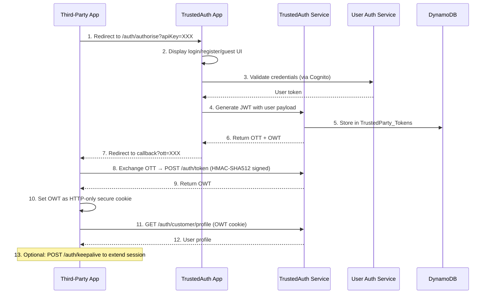

# C1 Context Architecture - Officeworks Third-Party Authentication System

## System Overview

The Officeworks Third-Party Authentication System is an OAuth-like authentication platform that enables third-party and non-core applications to authenticate customers. The system is built on a microservices architecture using HMAC-SHA512 signature authentication with AWS infrastructure.

```plantuml
@startuml C1_Context
!include https://raw.githubusercontent.com/plantuml-stdlib/C4-PlantUML/master/C4_Context.puml

LAYOUT_WITH_LEGEND()

title C1 Context Diagram — Officeworks Third-Party Authentication System

Person(customer, "Customer", "Officeworks customer\nauthenticating via a partner app")
Person(admin, "Web Wizards Team", "Registers and manages\ntrusted party credentials")

System_Boundary(tp_apps, "Third-Party Applications") {
    System_Ext(tp_react, "React/Node App", "Partner app using TARAS\nor TANK client library")
    System_Ext(tp_browser, "Browser App", "Partner app using\nauthclient.js (iframe)")
    System_Ext(tp_other, "Any Stack App", "Partner app using\ndirect API calls")
}

System_Boundary(ow_auth, "Officeworks TrustedAuth System\n[DEPRECATED — Jan 2026]") {
    System(trustedauth_app, "trustedauth-app", "OAuth-like UI & authorization\nflow handler (Port 3001/3003)")
    System(trustedauth_service, "trustedauth-service", "Core backend API — token\ngeneration & validation (Port 3002)")
    System(trustedauth_profile, "trustedauth-profile", "Customer profile endpoint\n(Port 3004)")
    System(user_auth_service, "user-auth-service", "Main user authentication\nvia AWS Cognito (Port 3000)")
}

System_Boundary(client_libs, "Client Libraries (NPM)") {
    System(tank, "trustedauth-node-client\n(TANK)", "Server-side Node.js integration\nlibrary")
    System(taras, "trustedauth-react-redux\n(TARAS)", "React/Redux component\nlibrary")
    System(browser_client, "trustedauth-client", "Browser JS library\n(iframe + postMessage, CDN/S3)")
}

System_Ext(cognito, "AWS Cognito", "User pool management,\ncredential validation")
System_Ext(dynamodb, "AWS DynamoDB", "Token and trusted party\nconfiguration storage")
System_Ext(s3, "AWS S3", "CDN distribution for\nauthclient.min.js")

Rel(customer, tp_react, "Authenticates via")
Rel(customer, tp_browser, "Authenticates via")
Rel(admin, trustedauth_service, "Manages trusted parties\nvia admin API", "HTTPS + X-OW-ADMIN-KEY")

Rel(tp_react, tank, "Uses")
Rel(tp_react, taras, "Uses")
Rel(tp_browser, browser_client, "Loads from CDN")

Rel(browser_client, trustedauth_app, "Renders login UI in iframe", "HTTPS")
Rel(tank, trustedauth_service, "Exchanges OTT, validates tokens", "HTTPS + HMAC-SHA512")
Rel(tank, trustedauth_profile, "Fetches user profile", "HTTPS")
Rel(taras, trustedauth_app, "Renders login UI in iframe", "HTTPS")

Rel(trustedauth_app, trustedauth_service, "Generates tokens", "HTTP internal")
Rel(trustedauth_app, user_auth_service, "Validates credentials", "HTTP internal")
Rel(trustedauth_service, user_auth_service, "Validates credentials,\nfetches auth tokens", "HTTP internal")
Rel(trustedauth_service, dynamodb, "Stores/reads tokens\nand party config", "AWS SDK")
Rel(trustedauth_profile, user_auth_service, "Fetches user profile", "HTTP internal")

Rel(user_auth_service, cognito, "Validates credentials,\nmanages users", "AWS SDK")
Rel(browser_client, s3, "Served from", "HTTPS")

@enduml
```

## System Components

### 1. **External Applications Layer**
- Third-party applications integrating with Officeworks authentication
- Can be built with any technology stack (React, Node.js, etc.)
- Implement client libraries (TANK, TARAS, or browser client)

### 2. **TrustedAuth Application Layer**
- **trustedauth-app**: OAuth authorization server UI and flow orchestrator
- **trustedauth-service**: Core API backend handling token generation and validation
- **trustedauth-profile**: Profile endpoint serving authenticated user information

### 3. **Client Integration Layer**
- **trustedauth-node-client (TANK)**: Server-side Node.js integration
- **trustedauth-react-redux (TARAS)**: React/Redux component library
- **trustedauth-client**: Browser-side JavaScript library

### 4. **Core Authentication Service**
- **user-auth-service**: AWS Cognito integration and user management
- Credential validation and session management

### 5. **Data Persistence**
- AWS DynamoDB for trusted party configuration and token storage
- Tables: TrustedParty_Api, TrustedParty_Tokens, TrustedParty_UserToken

### 6. **Infrastructure**
- AWS Elastic Beanstalk for web services
- AWS ECS for containerized services
- AWS S3 for CDN distribution
- AWS CloudFormation for infrastructure as code

## Key Characteristics

| Aspect | Detail |
|--------|--------|
| **Authentication Method** | HMAC-SHA512 signature-based |
| **Authorization Pattern** | OAuth-like flow with OTT/OWT tokens |
| **Token Lifecycle** | OTT (short-lived) → OWT (8 hours, HTTP-only cookie) |
| **Data Storage** | AWS DynamoDB |
| **User Management** | AWS Cognito |
| **Deployment Target** | AWS (Elastic Beanstalk, ECS) |
| **Protocol** | HTTPS only |
| **Status** | **DEPRECATED** - Scheduled for decommissioning January 2026 |

## Request Flow with Authentication



## Deployment Architecture

```plantuml
@startuml Deployment
!include https://raw.githubusercontent.com/plantuml-stdlib/C4-PlantUML/master/C4_Deployment.puml

LAYOUT_WITH_LEGEND()

title Deployment Architecture — AWS ap-southeast-2

Deployment_Node(aws, "AWS ap-southeast-2") {

    Deployment_Node(eb, "Elastic Beanstalk Environment") {
        Deployment_Node(lb, "Load Balancer") {
        }
        Deployment_Node(asg, "Auto Scaling Group") {
            Deployment_Node(ec2a, "EC2 Instance A") {
                Container(app_a, "trustedauth-app", "Node.js :3001")
                Container(svc_a, "trustedauth-service", "Node.js :3002")
                Container(profile_a, "trustedauth-profile", "Node.js :3004")
            }
            Deployment_Node(ec2b, "EC2 Instance B") {
                Container(app_b, "trustedauth-app", "Node.js :3001")
                Container(svc_b, "trustedauth-service", "Node.js :3002")
                Container(profile_b, "trustedauth-profile", "Node.js :3004")
            }
        }
    }

    Deployment_Node(ecs, "ECS Cluster") {
        Deployment_Node(task1, "ECS Task 1") {
            Container(uas1, "user-auth-service", "Node.js+TS :3000")
        }
        Deployment_Node(task2, "ECS Task 2") {
            Container(uas2, "user-auth-service", "Node.js+TS :3000")
        }
    }

    Deployment_Node(data, "Data Services") {
        ContainerDb(dynamo, "DynamoDB", "TrustedParty_Api\nTrustedParty_Tokens\nTrustedParty_UserToken")
        ContainerDb(cognito, "Cognito User Pool", "User credentials\nSession management\nMFA")
    }

    Deployment_Node(cdn, "Content Distribution") {
        Container(s3, "S3 Bucket", "authclient.min.js\nCDN distribution")
    }
}

@enduml
```

## Integration Patterns

### Pattern 1: Browser-Based Integration
1. Load authclient.min.js from CDN
2. Add `<ow-auth>` custom element to page
3. User completes authentication in iframe
4. window.postMessage communicates result to parent
5. Third-party sets OWT cookie

### Pattern 2: Server-Side Integration (Node.js)
1. Implement using TANK (trustedauth-node-client)
2. Create AuthClient with apiKey, serverUrl, secret
3. Use exchangeToken(ott) to get OWT
4. Use getProfile(owt) to fetch user data
5. Apply expressMiddleware for protected routes

### Pattern 3: React/Redux Integration
1. Use TARAS (trustedauth-react-redux)
2. Inject OWAuth component at root level
3. Setup Redux middleware for auto-login
4. Dispatch actions for login/register
5. User profile automatically synced to Redux state

---

**Status Note**: This system is marked for deprecation and will be decommissioned in January 2026. No new systems should integrate with this service. Reach out to Web Wizards for alternative authentication solutions.
