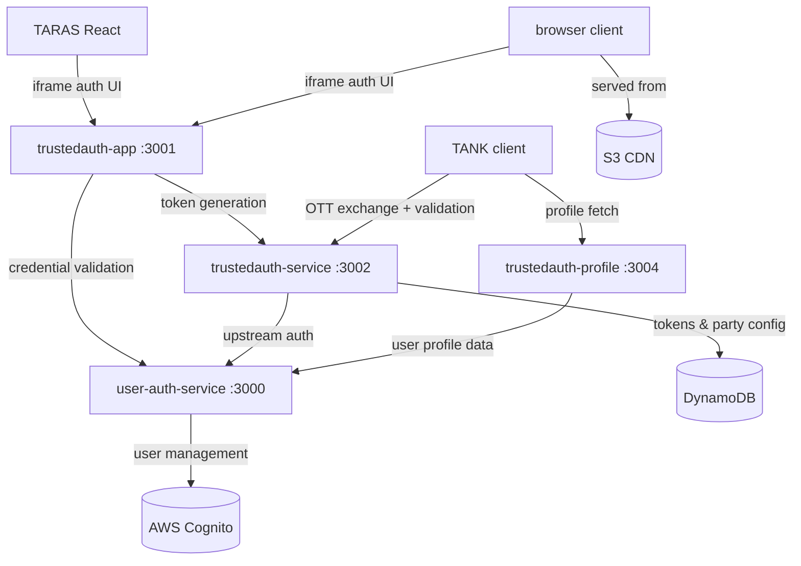
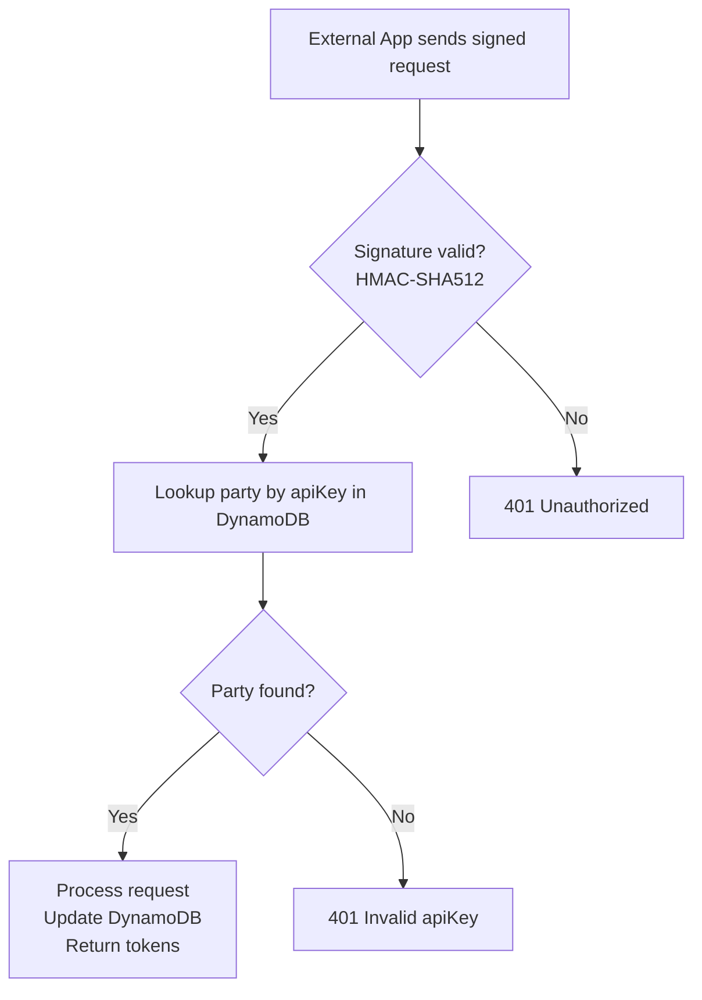
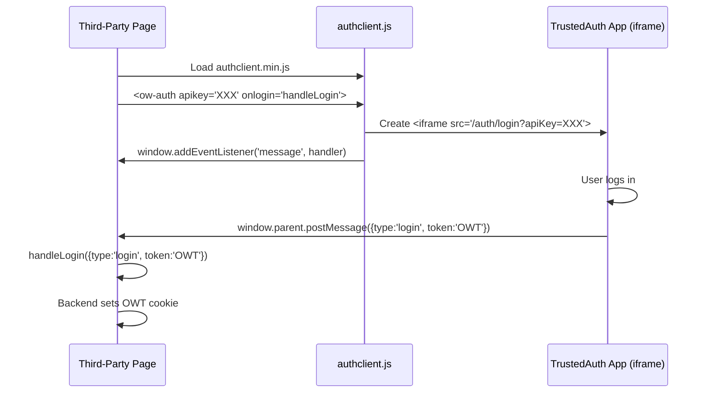
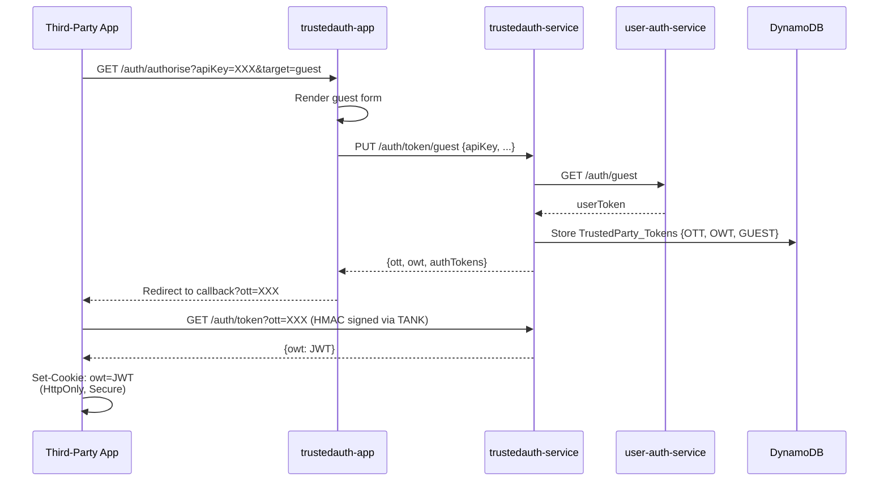

# C2 Container Architecture - Officeworks Third-Party Authentication System

## Overview

This document describes the individual containers (applications, services, and libraries) that comprise the third-party authentication system, their responsibilities, technologies, and interactions.

---

## Container Diagram

```plantuml
@startuml C2_Container
!include https://raw.githubusercontent.com/plantuml-stdlib/C4-PlantUML/master/C4_Container.puml

LAYOUT_WITH_LEGEND()

title C2 Container Diagram — Officeworks TrustedAuth System

Person_Ext(customer, "Customer", "End user authenticating\nthrough a partner app")
Person_Ext(admin, "Web Wizards Admin", "Manages trusted party\ncredentials")

System_Boundary(client_side, "Client Integration Layer (NPM/CDN)") {
    Container(browser_client, "trustedauth-client", "JavaScript (ES5)", "Custom <ow-auth> HTML element, iframe-based auth UI, window.postMessage. Served from S3/CDN.")
    Container(tank, "trustedauth-node-client (TANK)", "Node.js", "Server-side client library. Handles HMAC-SHA512 signing, OTT→OWT exchange, Express middleware.")
    Container(taras, "trustedauth-react-redux (TARAS)", "React + Redux", "OWAuth component, Redux middleware/reducer for auth state management.")
}

System_Boundary(ow_auth, "Officeworks TrustedAuth System [DEPRECATED Jan 2026]") {
    Container(trustedauth_app, "trustedauth-app", "Express.js + Handlebars", "OAuth-like authorization server UI. Renders login, register, guest forms. Handles OAuth callback redirects. Port 3001/3003.")
    Container(trustedauth_service, "trustedauth-service", "Express.js + Node.js", "Core backend API. Token generation, HMAC-SHA512 validation, trusted party management, DynamoDB operations. Port 3002.")
    Container(trustedauth_profile, "trustedauth-profile", "Express.js + Node.js", "Customer profile endpoint. Validates OWT, fetches profile from upstream API. Port 3004.")
    Container(user_auth_service, "user-auth-service", "Express.js + TypeScript", "Main user auth backend. AWS Cognito integration, credential validation, session management. Port 3000.")
}

ContainerDb(dynamodb, "AWS DynamoDB", "NoSQL", "TrustedParty_Api\nTrustedParty_Tokens\nTrustedParty_UserToken")
ContainerDb(cognito, "AWS Cognito", "Identity", "User pools, MFA,\ncredential validation")
ContainerDb(s3, "AWS S3", "Object Store", "authclient.min.js CDN\ndistribution")

' External relationships
Rel(customer, browser_client, "Interacts with login UI via", "iframe in browser")
Rel(admin, trustedauth_service, "Manages trusted parties", "HTTPS + X-OW-ADMIN-KEY")

' Client lib to server
Rel(browser_client, trustedauth_app, "Loads login UI into iframe", "HTTPS")
Rel(tank, trustedauth_service, "Exchanges OTT for OWT\nValidates tokens", "HTTPS + HMAC-SHA512")
Rel(tank, trustedauth_profile, "Fetches user profile", "HTTPS")
Rel(taras, trustedauth_app, "Renders iframe auth UI", "HTTPS")

' Internal service calls
Rel(trustedauth_app, trustedauth_service, "Requests token generation\nafter credential validation", "HTTP :3002")
Rel(trustedauth_app, user_auth_service, "Validates user credentials", "HTTP :3000")
Rel(trustedauth_service, user_auth_service, "Validates credentials,\nfetches auth tokens", "HTTP :3000")
Rel(trustedauth_profile, user_auth_service, "Fetches upstream user profile", "HTTP :3000")

' Infrastructure
Rel(trustedauth_service, dynamodb, "Reads/writes tokens\nand party config", "AWS SDK v3")
Rel(user_auth_service, cognito, "User pool operations", "AWS SDK")
Rel(browser_client, s3, "Served from", "HTTPS CDN")

@enduml
```

---

## Service Specifications

### 1. trustedauth-app (OAuth Authorization Server UI)

| Property | Value |
|----------|-------|
| **Technology** | Express.js + Handlebars templates |
| **Port** | 3001 (external), 3003 (iframe mode) |
| **Host** | AWS Elastic Beanstalk |
| **Responsibility** | OAuth-like authorization flow & user interface |

**Key Routes:**

| Method | Path | Purpose |
|--------|------|---------|
| GET | `/auth/login` | Login form & flow |
| GET | `/auth/register` | Registration form |
| GET | `/auth/authorise` | OAuth authorization endpoint |
| GET | `/auth/guest` | Guest token request flow |

**Responsibilities:**
1. Render authentication UI (login, register, guest)
2. Validate user input
3. Coordinate with user-auth-service for credential validation
4. Call trustedauth-service to generate tokens
5. Handle OAuth callback redirect with OTT parameter
6. Support multiple environment modes (local, test, master)

---

### 2. trustedauth-service (Core API — Token Generation & Validation)

| Property | Value |
|----------|-------|
| **Technology** | Express.js + Node.js |
| **Port** | 3002 |
| **Host** | AWS Elastic Beanstalk |
| **Responsibility** | Token lifecycle management, signature validation |

**Key Modules:**

- **tpapi.js** — DynamoDB operations for trusted parties; `findById`, `findByApiKey`, `genToken`, `validateSignature`
- **userapi.js** — HTTP client for user-auth-service; `guestToken`, `authTokens`, `login`
- **util.js** — `hash`, `uuid4`, `genRandomStr`, `isValidAbn`, `getSignaturePayLoadFromRequest`

**API Routes:**

| Method | Path | Purpose |
|--------|------|---------|
| POST | `/auth/tp/:tpId` | Create trusted party with ID |
| PUT | `/auth/tp/:tpId` | Update trusted party |
| DELETE | `/auth/tp/:tpId` | Delete trusted party |
| GET | `/auth/tp/:tpId` | Get party by ID |
| GET | `/auth/tp/apiKey/:apiKey` | Get party by API key |
| PUT | `/auth/token/guest` | Generate guest token |
| PUT | `/auth/register/business` | Register business account |
| PUT | `/auth/register` | Register personal account |
| POST | `/auth/login` | Login and issue token |
| POST | `/auth/token/validate` | Validate given token |
| GET | `/auth/token` | Exchange OTT → OWT |
| POST | `/auth/keepalive` | Keep user session alive |

**Key Features:**
1. HMAC-SHA512 signature validation for all signed requests
2. JWT token generation with configurable expiry (default 8h)
3. One-Time Token (OTT) for secure token exchange
4. Request logging with unique request IDs
5. Nonce tracking for replay attack prevention
6. Support for guest, personal, and business user types

---

### 3. trustedauth-profile (Customer Profile Service)

| Property | Value |
|----------|-------|
| **Technology** | Express.js + Node.js |
| **Port** | 3004 |
| **Host** | AWS Elastic Beanstalk |
| **Responsibility** | Return authenticated customer profile data |

**Key Routes:**

| Method | Path | Purpose |
|--------|------|---------|
| GET | `/auth/customer/profile` | Get profile (requires OWT token) |
| GET | `/status` | Health check |

**Responsibilities:**
1. Validate OWT token signature
2. Call upstream API to fetch user profile
3. Return profile: userId, userName, email, phone, userType, firstName, lastName, business details
4. Cache responses to reduce upstream calls

**Response Example:**
```json
{
  "userId": "20786849",
  "userName": "John Doe",
  "userType": "BUSINESS",
  "email": "john@example.com",
  "firstName": "John",
  "lastName": "Doe",
  "phone": "0401111222",
  "mobile": null,
  "custBP": "20786849",
  "orgBP": "20786848"
}
```

---

### 4. user-auth-service (Main User Authentication Service)

| Property | Value |
|----------|-------|
| **Technology** | Node.js + Express + TypeScript |
| **Port** | 3000 |
| **Host** | AWS ECS (Elastic Container Service) |
| **Responsibility** | User credential validation, session management |

**Key Components:**
- AWS Cognito User Pool integration
- User credential validation
- Multi-factor authentication support
- Session token generation
- Account registration (personal & business)
- Account recovery and password reset

**OpenAPI Specification:**
- `/app/spec/swagger.yaml` — Full API specification
- `/app/spec/paths.yaml` — Endpoint definitions
- `/app/spec/definitions.yaml` — Data models
- `/app/spec/parameters.yaml` — Parameter definitions

**Infrastructure as Code:**
- CloudFormation templates for Cognito user pools
- ECS task definitions
- IAM role definitions for task execution

**Responsibilities:**
1. Manage user credentials securely via Cognito
2. Provide user account lifecycle management
3. Return authenticated user tokens
4. Maintain OpenAPI specification

---

## Client Libraries

### 5. trustedauth-client (Browser Library)

| Property | Value |
|----------|-------|
| **Format** | `authclient.min.js` (minified, CDN) |
| **CDN** | `https://s3-ap-southeast-2.amazonaws.com/trustedauth-client/authclient.min.js` |
| **Runtime** | Browser (requires DOM & window object) |

**Custom Element Attributes:**

| Attribute | Required | Values | Purpose |
|-----------|----------|--------|---------|
| `apikey` | Yes | string | Third-party API key |
| `onlogin` | No | function name | Callback on login success |
| `mode` | No | `local`\|`test`\|`prod` | Environment routing |
| `target` | No | `login`\|`register`\|`guest` | Initial flow |
| `guest` | No | `true`\|`false` | Show guest option |
| `debug` | No | `true`\|`false` | Enable debug logging |

**Domain Routing by Mode:**

| Mode | Domain |
|------|--------|
| `local` | `http://localhost:3003` |
| `test` | `https://ofwtest.officeworks.com.au` |
| default/`prod` | `https://www.officeworks.com.au` |

**How It Works:**
1. User adds `<ow-auth apikey="XXX" />` to page
2. authclient.js creates iframe pointing to TrustedAuth login page
3. User interacts within iframe
4. iframe posts message back to parent via `window.postMessage`
5. Parent app receives message with login status and OWT

**postMessage Protocol:**
```json
{
  "type": "login | logout | register",
  "guest": false,
  "token": "<OWT JWT>"
}
```

---

### 6. trustedauth-node-client (TANK — Server-Side Library)

| Property | Value |
|----------|-------|
| **NPM Package** | `@ow/trustedauth-node-client` |
| **Runtime** | Node.js 10+ |
| **Main Export** | `{ Client }` |

**Constructor:**
```javascript
new Client(apiKey, serverUrl, internalServerUrl, signatureSecret)
```

**Public Methods:**

| Method | Purpose | Signed? |
|--------|---------|---------|
| `getProfile(owt)` | Fetch authenticated user profile | Yes |
| `exchangeToken(ott)` | Exchange one-time token for OWT | Yes |
| `validateToken(owt)` | Validate OWT (internal endpoint only) | Yes |
| `expressMiddleware(whitelist)` | Express middleware for protected routes | N/A |

**Request Signing Process:**
1. Generate random nonce
2. Build signing string: `ow-api-key={apiKey}&ow-nonce={nonce}&owt={token}`
3. Compute `HMAC-SHA512(signingString, secret)`
4. Add headers: `x-ow-signature`, `x-ow-nonce`, `x-ow-signing-string`
5. Send HTTP request with signed headers

**Usage Example:**
```javascript
const { Client } = require('@ow/trustedauth-node-client');

const authClient = new Client(
  'api-key-123',
  'https://ofwtest.officeworks.com.au',
  'http://internal-server.local',
  'secret-key-456'
);

authClient.exchangeToken(req.query.ott)
  .then(resp => {
    res.cookie('owt', resp.owt, { httpOnly: true, secure: true });
    res.json({ success: true });
  });
```

---

### 7. trustedauth-react-redux (TARAS — React Library)

| Property | Value |
|----------|-------|
| **NPM Package** | `@ow/trustedauth-react-redux` |
| **Runtime** | React 15+ + Redux |

**Key Exports:**

| Export | Type | Purpose |
|--------|------|---------|
| `OWAuth` | React Component | Authentication UI modal/iframe |
| `OWAuthMiddleware` | Redux Middleware | Intercepts actions, enforces auth |
| `OWAuthReducer` | Redux Reducer | Manages `owauth` state slice |
| `OWAuthPropType` | PropTypes | Type validation for owauth state |

**Redux State Shape (`owauth` key):**
```javascript
{
  isLoggedIn: boolean,
  userProfile: UserProfile | null,
  showModal: boolean,
  error: string | null,
  isLoading: boolean,
  config: { apiKey: string, serverHostname: string }
}
```

**Setup Example:**
```javascript
import { OWAuth, OWAuthMiddleware, OWAuthReducer } from '@ow/trustedauth-react-redux';

const store = createStore(
  combineReducers({ owauth: OWAuthReducer }),
  applyMiddleware(
    OWAuthMiddleware(
      action => action.type === 'FETCH_DATA',  // isApplicable
      '/api/profile',                           // profileURI
      true                                      // autoLogin
    )
  )
);

export default function App() {
  return (
    <Provider store={store}>
      <OWAuth apiKey="YOUR_API_KEY" serverHostname="https://ofwtest.officeworks.com.au" />
      {/* ... rest of app ... */}
    </Provider>
  );
}
```

---

## Container Dependencies



---

## Container Communication Patterns

### HTTP/HTTPS Communication with HMAC-SHA512



### Browser iframe Message Passing



---

## Data Flow Examples

### Guest Token Flow



---

**Status**: System is marked for deprecation (January 2026). No new integrations should be created.
