# C3 Component Architecture - Officeworks Third-Party Authentication System

## Overview

This document describes the detailed components within each container, including modules, classes, functions, and their interactions.

---

## 1. TrustedAuth Service Components

### trustedauth-service (Port 3002)

#### Module: tpapi.js
**Purpose**: Trusted Party API operations and token management

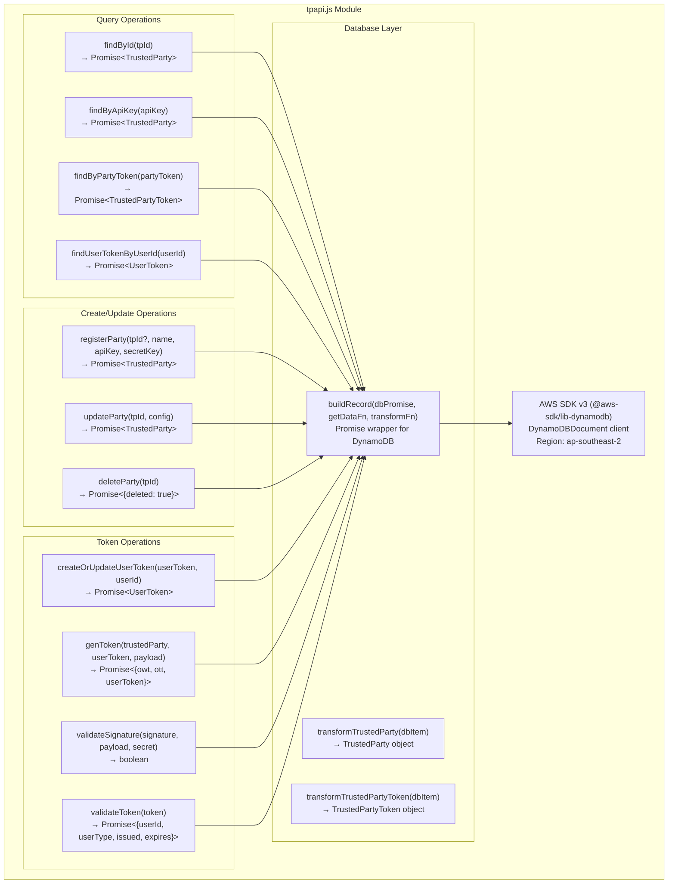

#### Module: userapi.js
**Purpose**: Upstream user authentication service integration

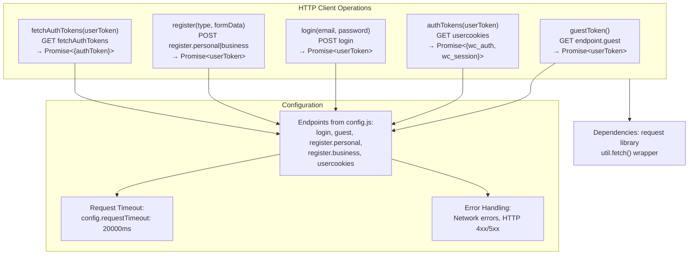

#### Module: util.js
**Purpose**: Utility functions for cryptography, validation, and helpers

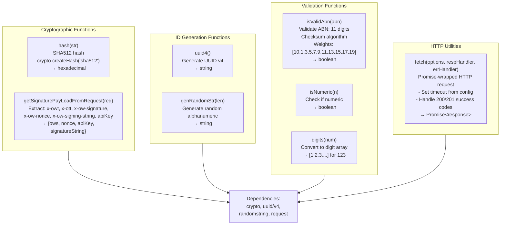

#### Module: routes/auth.js
**Purpose**: Customer authentication endpoints

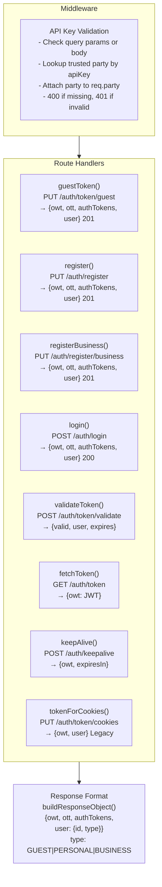

#### Module: routes/tpAdmin.js
**Purpose**: Trusted Party management endpoints (admin only)

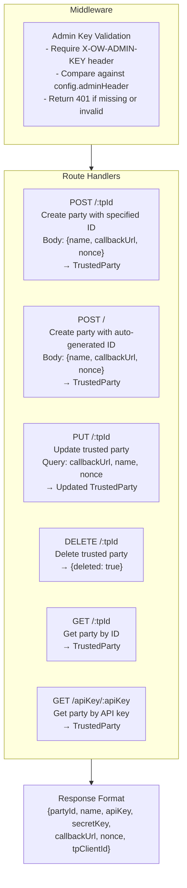

#### Module: routes/userAdmin.js
**Purpose**: User authentication admin endpoints

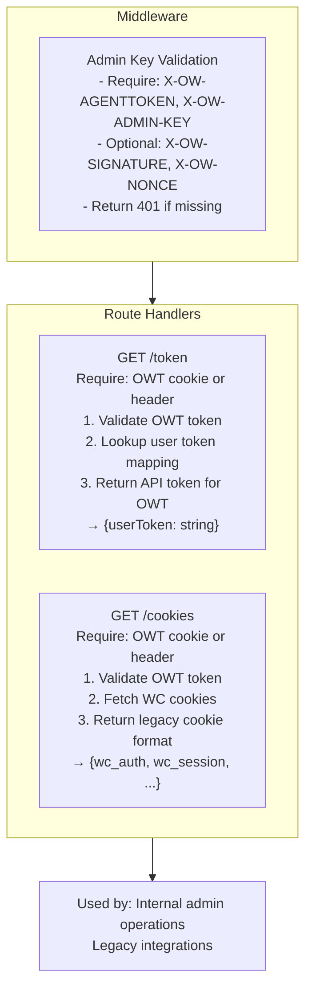

---

### trustedauth-app (Port 3001)

```mermaid
graph TB
    subgraph views["Views - Handlebars Templates"]
        login["login.hbs<br/>Login form with<br/>email/password"]
        register["register.hbs<br/>Registration form<br/>Personal: email, password,<br/>firstName, lastName<br/>Business: companyName, abn, etc"]
        guest["guest.hbs<br/>Continue as Guest button"]
        authorize["authorize.hbs<br/>OAuth authorization<br/>confirmation"]
    end
    
    subgraph routes["Routes"]
        loginGet["GET /auth/login<br/>Render login form<br/>Params: apiKey, cb, target"]
        registerGet["GET /auth/register<br/>Render registration form<br/>Params: apiKey, cb"]
        loginPost["POST /auth/login<br/>Process form<br/>Call trustedauth-service<br/>Redirect callback?ott=XXX"]
        registerPost["POST /auth/register<br/>Process registration<br/>Auto-login + redirect"]
        guestGet["GET /auth/guest<br/>Generate guest token<br/>Call trustedauth-service<br/>Redirect callback?ott=XXX"]
        authorise["GET /auth/authorise<br/>Main OAuth endpoint<br/>Route to login/register/guest<br/>Params: apiKey, cb, target, guest"]
    end
    
    subgraph client["Client-side JavaScript"]
        owauth["lib/client/owauth.js<br/>Communication with parent window<br/>window.postMessage for iframe<br/>Pass login/register/guest events"]
        js["public/js/<br/>jQuery manipulation<br/>Form validation"]
    end
    
    config["Configuration<br/>Support: local/test/master<br/>environments"]
    
    views --> routes
    routes --> client
    client --> config
```

---

## 3. TrustedAuth Profile Components

### trustedauth-profile (Port 3004)

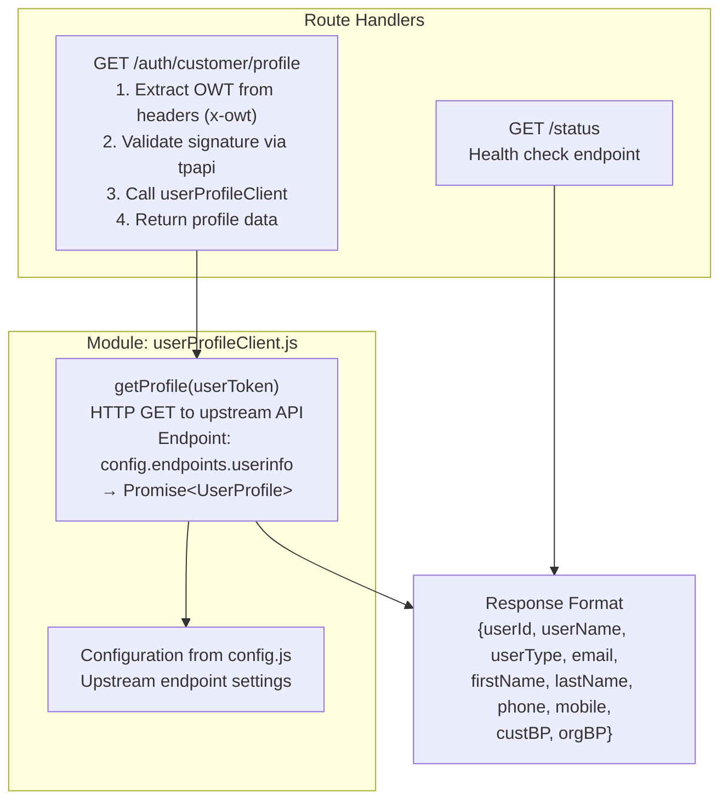

---

## 4. User Auth Service Components

### user-auth-service (AWS ECS)

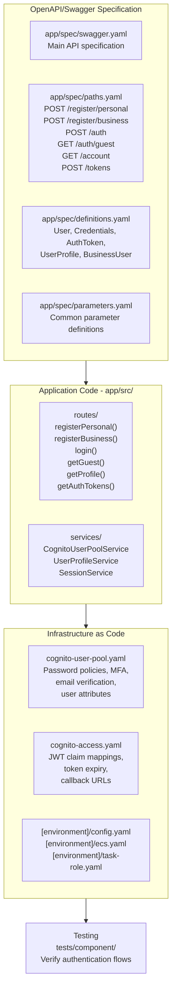

---

## 5. Client Library Components

### trustedauth-node-client (TANK)

```mermaid
graph TB
    subgraph client["class Client"]
        constructor["Constructor(apiKey, serverUrl,<br/>internalServerUrl, secret)"]
        
        subgraph public["Public Methods"]
            getProfile["getProfile(owt)<br/>→ Promise&lt;UserProfile&gt;<br/>Calls signedReq()"]
            exchangeToken["exchangeToken(ott)<br/>→ Promise&lt;{owt}&gt;<br/>Exchange OTT for OWT"]
            validateToken["validateToken(owt)<br/>→ Promise&lt;ValidationResult&gt;<br/>Internal endpoint only"]
            middleware["expressMiddleware(whitelist)<br/>→ Express middleware<br/>Validate owt cookie on paths"]
        end
        
        subgraph private["Private Methods"]
            signedReq["signedReq(method, uri, params, headers)<br/>1. Generate random nonce<br/>2. Create signing string<br/>3. HMAC-SHA512(signing string, secret)<br/>4. Add headers to request<br/>5. Send HTTP request<br/>→ Promise&lt;response&gt;"]
            req["req(method, uri, headers, internal)<br/>Unsigned HTTP request wrapper"]
        end
    end
    
    subgraph express["Express Helper<br/>src/auth/expressHelper.js"]
        factory["Express middleware factory<br/>- Attach to app.use()<br/>- Validate owt cookie<br/>- Pass auth context to next"]
    end
    
    deps["Dependencies<br/>- node-rest-client (HTTP)<br/>- crypto (HMAC-SHA512)<br/>- promise"]
    
    constructor --> public
    public --> private
    express --> factory
    factory --> deps
    private --> deps
```

### trustedauth-react-redux (TARAS)

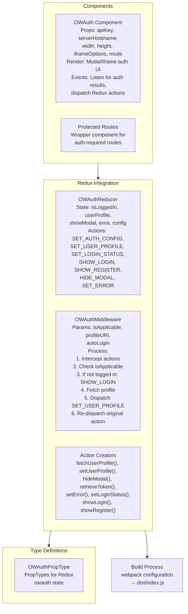

### trustedauth-client (Browser Library)

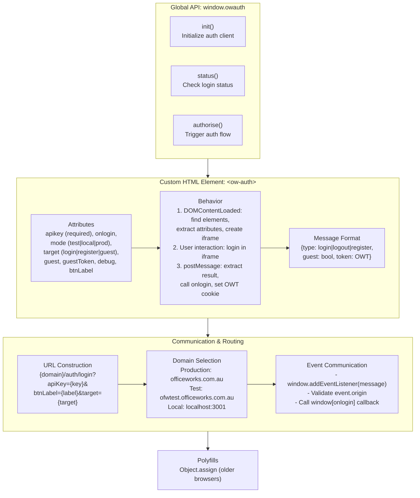

---

## 6. Database Schema (DynamoDB)

### Table: TrustedParty_Api

| Attribute | Type | Key | Notes |
|-----------|------|-----|-------|
| PartyId | String | HASH (PK) | Unique party identifier |
| Name | String | | Display name |
| ApiKey | String | GSI: ApiKey-index | Public API key |
| Secret | String | | Private HMAC secret |
| CallbackUrl | String | | OAuth callback endpoint |
| Nonce | String | | Security nonce |
| TpClientId | String | | Client identifier |
| CreatedAt | Number | | Epoch timestamp |

**Example item:**
```json
{
  "PartyId": "90003",
  "Name": "accis",
  "ApiKey": "Izj5SZEe8b7L4vxG01N0",
  "Secret": "OIHMFfAv24sInyNd6EOdzrVTRMxOtct8QXSOUV18",
  "CallbackUrl": "http://www.owt.com",
  "Nonce": "393939393939",
  "TpClientId": "90003"
}
```

### Table: TrustedParty_Tokens

| Attribute | Type | Key | Notes |
|-----------|------|-----|-------|
| UserToken | String | HASH (PK) | User token from upstream |
| PartyId | String | RANGE (SK) | Trusted party ID |
| PartyToken | String | | JWT token (OWT) issued |
| OneTimeToken | String | | OTT for token exchange |
| UserId | String | | Upstream user ID |
| IssueTime | Number | | Epoch timestamp |
| ExpiryTime | Number | | TTL — 8 hours from issue |
| UserType | String | | `GUEST` \| `PERSONAL` \| `BUSINESS` |

**Example item:**
```json
{
  "UserToken": "user-token-123",
  "PartyId": "90003",
  "PartyToken": "JWT...",
  "OneTimeToken": "ott-abc-def",
  "UserId": "customer-123",
  "IssueTime": 1696000000,
  "ExpiryTime": 1696028800,
  "UserType": "PERSONAL"
}
```

### Table: TrustedParty_UserToken

| Attribute | Type | Key | Notes |
|-----------|------|-----|-------|
| UserId | String | HASH (PK) | User identifier |
| UserToken | String | | Maps to upstream user token |
| CreatedAt | Number | | Epoch timestamp |

---

## 7. Request/Response Signing

### HMAC-SHA512 Signature Algorithm

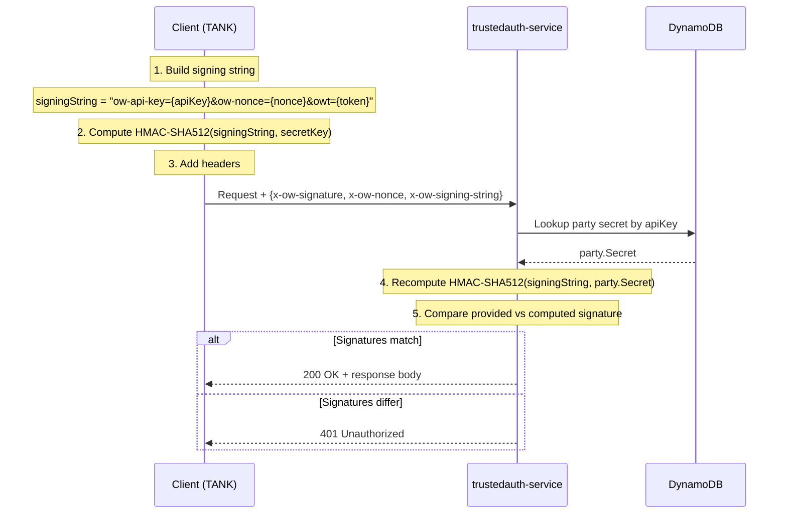

**Implementation (Node.js):**
```javascript
const crypto = require('crypto');

function sign(dataToSign, secret) {
  return crypto
    .createHmac('sha512', secret)
    .update(dataToSign)
    .digest('hex');
}

// Signing string format (ordered params):
const signingString = `ow-api-key=${apiKey}&ow-nonce=${nonce}&owt=${token}`;
const signature = sign(signingString, secretKey);
```

**Protected Request Headers:**

| Header | Value | Required |
|--------|-------|----------|
| `X-OW-SIGNATURE` | Hex-encoded HMAC-SHA512 | Yes |
| `X-OW-NONCE` | Random string (per-request) | Yes |
| `X-OW-AGENTTOKEN` | Agent credentials (admin only) | Admin routes |
| `X-OW-ADMIN-KEY` | Admin API key | Admin routes |

---

## Summary Table

| Component | Technology | Responsibility | Port |
|-----------|-----------|-----------------|------|
| trustedauth-app | Express + Handlebars | OAuth UI & authorization | 3001/3003 |
| trustedauth-service | Express + Node.js | Token generation & validation | 3002 |
| user-auth-service | Node.js + TypeScript + Cognito | User credential validation | 3000 |
| trustedauth-profile | Express + Node.js | User profile endpoint | 3004 |
| trustedauth-node-client | NPM package | Server-side integration | — |
| trustedauth-react-redux | NPM package | React/Redux integration | — |
| trustedauth-client | Browser JS (CDN) | Client-side authentication | — |

---

**Deprecation Status**: System will be decommissioned January 2026.
