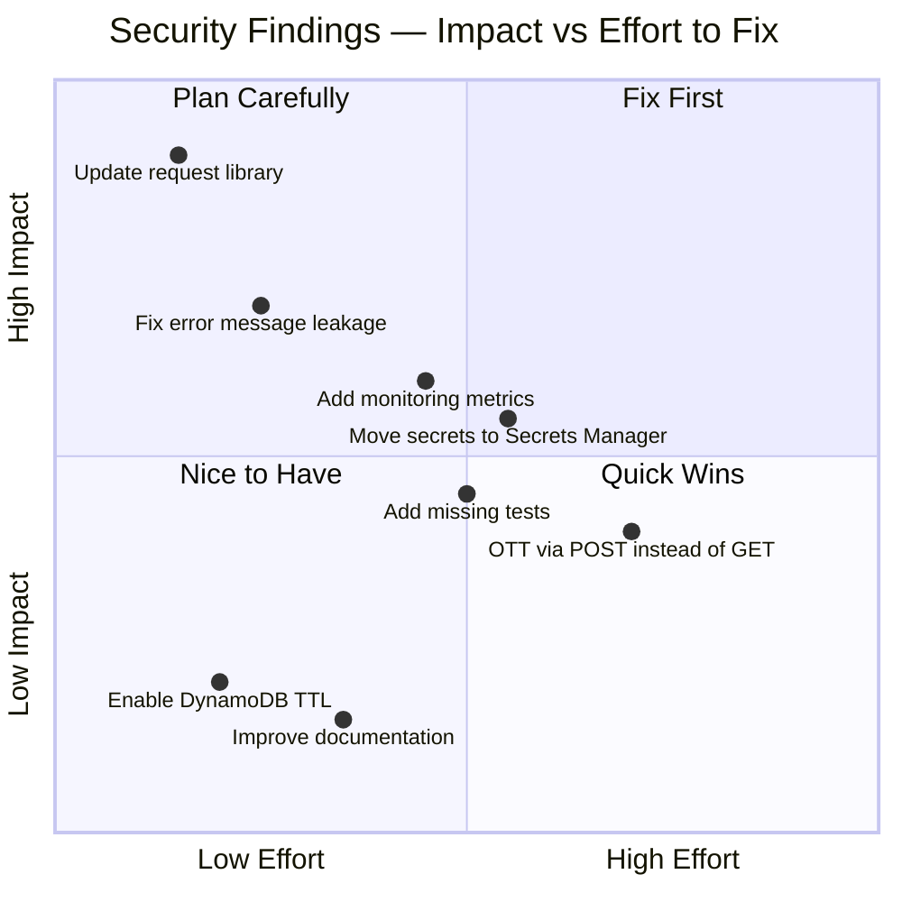

# Consistency Review - Officeworks Third-Party Authentication System

## Overview

This document performs a comprehensive review of architectural consistency, design patterns, security practices, and integration patterns across all seven repositories in the third-party authentication system.

---

## 1. Architectural Consistency

### 1.1 Layered Architecture Compliance

**Assessment**: CONSISTENT

**Findings**: All services follow a standard 3-layer architecture:

1. Route handlers (Express/HTTP layer)
2. Business logic (Service modules)
3. Data access (DynamoDB/API clients)

**Details**:

```
trustedauth-service:
  routes/auth.js          → Route handlers
  lib/tpapi.js            → DB operations
  lib/userapi.js          → Upstream API client
  lib/util.js             → Utilities
  lib/logger.js           → Logging

trustedauth-profile:
  routes/customer.js      → Route handlers
  userProfileClient.js    → API client
  config.js               → Configuration

user-auth-service:
  app/src/routes/         → Route handlers
  app/src/services/       → Business logic
  CloudFormation          → Infrastructure
```

**Recommendation**: MAINTAIN — Current structure is sound

---

### 1.2 Configuration Management

**Assessment**: CONSISTENT with minor inconsistencies

| Repository | Config Method | Pattern | Consistency |
|------------|----------------|---------|-------------|
| trustedauth-service | config.js | Environment-based object | Standard |
| trustedauth-profile | config.js | Environment-based object | Standard |
| trustedauth-app | Not documented | Likely hardcoded | Unclear |
| user-auth-service | CloudFormation + YAML | IaC approach | Modern |
| TANK | Constructor params | Runtime injection | Flexible |
| TARAS | Redux action dispatch | State management | Appropriate |
| Browser client | HTML attributes | Element-based | Unique |

**Issues Found**:
1. trustedauth-app configuration method not documented
2. Mixed configuration patterns (code-based vs IaC)
3. No centralized secrets management (hardcoded keys in config.js)

**Recommendations**:
1. Document trustedauth-app config approach
2. Migrate hardcoded secrets to AWS Secrets Manager
3. Use environment variables consistently across all services
4. Consider centralized config service

**Priority**: Medium

---

### 1.3 Port Assignment Consistency

**Assessment**: CONSISTENT

```
trustedauth-app         → 3001  (Authorization UI)
trustedauth-service     → 3002  (API)
user-auth-service       → 3000  (Auth backend)
trustedauth-profile     → 3004  (Profile endpoint)
```

**Pattern**: Sequential ports (3000–3004) are easy to remember, avoid conflicts with common ports, and follow numerical ordering by function.

**Recommendation**: MAINTAIN

---

## 2. Security Consistency

### 2.1 Authentication Mechanism

**Assessment**: CONSISTENT

**Mechanism**: HMAC-SHA512 signature-based authentication

| Component | Implementation | Algorithm | Consistent |
|-----------|----------------|-----------|-----------|
| trustedauth-service | lib/tpapi.js | HMAC-SHA512 | Yes |
| TANK client | src/auth/client.js | HMAC-SHA512 | Yes |
| Browser client | postMessage | N/A (iframe) | Yes |
| TARAS | Redux state | N/A (wrapper) | Yes |

All signed requests use the identical algorithm:
```javascript
crypto.createHmac('sha512', secret).update(data).digest('hex')
```

**Recommendation**: MAINTAIN

---

### 2.2 Token Management

**Assessment**: CONSISTENT

**Token Types**:
- **OWT** (Officeworks Token): JWT, 8-hour expiry, HTTP-only cookie
- **OTT** (One-Time Token): Random string, ~10 minute expiry, single-use

| Aspect | Implementation | Consistent |
|--------|----------------|-----------|
| OWT format | JWT | Yes |
| OWT expiry | 8 hours (configurable) | Yes |
| OWT storage | HTTP-only cookie + header | Yes |
| OTT generation | Random string (32 chars) | Yes |
| OTT validation | Single-use, time-limited | Yes |
| OTT transport | Query parameter in callback | Concern — see below |

**Issues Found**:
- OTT transported via URL query parameter (less secure than POST body)
  - Could be logged in access logs
  - Could be stored in browser history
  - Consider POST-based token exchange

**Priority**: Low — functional, but could be improved

---

### 2.3 Signature Validation

**Assessment**: CONSISTENT

**Validated request pattern:**

```
GET /auth/token?ott=OTT_VALUE
Headers:
  x-ow-signature:      HMAC-SHA512(signingString, secret)
  x-ow-nonce:          random_value
  x-ow-signing-string: ow-api-key={apiKey}&ow-nonce={nonce}&owt={token}
```

**Validation Steps (consistent across services):**
1. Extract signature from header
2. Lookup party secret by apiKey
3. Recompute HMAC-SHA512
4. Compare signatures
5. Check nonce (replay prevention)

**Note on Guest Flow**: Guest flow does not require a signature on the initial redirect — this is intentional. The guest endpoint is public (no sensitive data exposed), and the signature is added by the third-party server before the OTT exchange.

**Recommendation**: MAINTAIN

---

### 2.4 Error Handling & Information Disclosure

**Assessment**: INCONSISTENT — Security issue

| Scenario | Response | Issue |
|----------|----------|-------|
| Invalid email format | `{err: "Invalid email"}` | Generic — OK |
| Email not in Cognito | `{err: "Invalid credentials"}` | Generic — OK |
| Invalid password | `{err: "Invalid credentials"}` | Generic — OK |
| User not confirmed | `{err: "Email not confirmed"}` | Reveals user exists |
| Invalid apiKey | `{err: "Invalid apikey"}` | Generic — OK |
| Invalid signature | `{err: "Invalid signature"}` | Could leak info |

**Security Issues**:
1. "Email not confirmed" reveals account existence — enumeration attack vector
2. Differentiating "Invalid signature" from "Invalid apiKey" leaks information

**Impact**: Medium — Could enable email enumeration

**Recommendations**:
1. Return generic "Authentication failed" for all credential errors
2. Log detailed failure reason server-side only
3. Return same HTTP status (401) for all auth failures
4. Implement rate limiting per IP/apiKey

**Priority**: High

---

### 2.5 HTTPS Enforcement

**Assessment**: CONSISTENT

- All production endpoints use HTTPS
- Browser client enforces HTTPS (except localhost for local development)
- Local development allows HTTP for localhost only

```
local:   http://localhost:3001
test:    https://ofwtest.officeworks.com.au
master:  https://www.officeworks.com.au
```

**Recommendation**: MAINTAIN

---

## 3. API Design Consistency

### 3.1 Endpoint Naming

**Assessment**: MOSTLY CONSISTENT

```
Consistent patterns:
  /auth/tp/*              → Trusted party CRUD
  /auth/user/*            → User admin operations
  /auth/login             → Login
  /auth/register          → Register
  /auth/token/*           → Token operations
  /auth/customer/profile  → Profile (noun-based)

Minor inconsistencies:
  PUT /auth/register      → Semantically should be POST (create)
  PUT /auth/token/guest   → Semantically should be POST (create)
  GET /auth/token         → Creates state (marks OTT used) — violates REST
```

**Recommendations**:
1. Document HTTP method selection rationale
2. Consider standardizing on POST for creation (non-breaking if done carefully)

**Priority**: Low

---

### 3.2 Response Format

**Assessment**: CONSISTENT

**Standard Response Format**:
```json
{
  "field1": "value1",
  "field2": "value2"
}
```

**Error Response Format**:
```json
{
  "err": "Error message",
  "status": 400
}
```

All services use the same format, all errors include `err` field, HTTP status code in body matches header.

**Recommendation**: MAINTAIN

---

### 3.3 Query Parameters vs Body Parameters

**Assessment**: INCONSISTENT

| Endpoint | Input Method | Notes |
|----------|--------------|-------|
| POST /login | Body | Correct |
| PUT /register | Body | Correct |
| GET /token | Query string | OTT exchange creates state — violates REST |
| PUT /auth/tp | Query params | Should use body for updates |
| GET /profile | Cookie | Correct for auth tokens |

**Issue**: `GET /auth/token` marks OTT as used — a side effect that violates HTTP GET semantics.

**Recommendation**: Change to `POST /auth/token` with body. Breaking change — plan carefully.

**Priority**: Medium

---

## 4. Data Model Consistency

### 4.1 DynamoDB Schema

**Assessment**: CONSISTENT

```
TrustedParty_Api
├─ Key: PartyId (HASH)
├─ GSI: ApiKey-index
└─ Pattern: Configuration storage

TrustedParty_Tokens
├─ Key: (UserToken HASH, PartyId RANGE)
└─ Pattern: Token lifecycle storage

TrustedParty_UserToken
├─ Key: UserId (HASH)
└─ Pattern: User → token mapping
```

**Naming Convention**: PascalCase for all attribute names — consistent across all tables.

**TTL Strategy**: Manual expiry via ExpiryTime attribute (no DynamoDB TTL). A cleanup job is required to purge expired records.

**Recommendation**: Consider enabling DynamoDB native TTL on ExpiryTime for automatic cleanup.

**Priority**: Low

---

### 4.2 User Profile Schema

**Assessment**: CONSISTENT

Profile fields are standardized across the system:

```json
{
  "userId": "string",
  "userName": "string",
  "userType": "GUEST | PERSONAL | BUSINESS",
  "email": "string",
  "firstName": "string",
  "lastName": "string",
  "phone": "string",
  "mobile": "string",
  "custBP": "string",
  "orgBP": "string"
}
```

Same schema used in: registration response, profile endpoint, JWT payload (user.id, user.type), and TARAS Redux state.

**Recommendation**: MAINTAIN

---

## 5. Logging & Monitoring Consistency

### 5.1 Logging Framework

**Assessment**: CONSISTENT

**Framework**: Winston logger (all Node.js services)

| Environment | Log Level |
|-------------|-----------|
| local | debug |
| test | debug |
| master | info |

**Logged Data** (consistent across services):
- Request ID (unique per request)
- HTTP method and URL
- Timestamps and processing time
- Status codes
- Errors and stack traces
- Authentication events (success/failure)
- Token generation/validation events

**Recommendation**: MAINTAIN

---

### 5.2 Monitoring Gaps

**Assessment**: INCOMPLETE

| Capability | Status | Notes |
|-----------|--------|-------|
| Logging to stdout (CloudWatch) | Present | |
| Error tracking with stack traces | Present | |
| Request IDs for tracing | Present | |
| Request latency metrics | Missing | |
| Error rate alerting | Missing | |
| Token generation/validation metrics | Missing | |
| Performance dashboards | Missing | |

**Recommendation**: Add CloudWatch metrics for token generation rate, validation success/failure, API response times, and error rates by type. Set alarms for high error rate and slow response times.

**Priority**: Medium

---

## 6. Testing Consistency

### 6.1 Test Coverage

**Assessment**: INCONSISTENT

| Repository | Test Files | Coverage | Type |
|------------|-----------|----------|------|
| trustedauth-service | tpapi.spec.js, userapi.spec.js, util.spec.js, auth.spec.js | Good | Unit + integration |
| trustedauth-profile | test/test.js | Minimal | Integration |
| user-auth-service | tests/component/ | Component tests | Integration |
| TANK | test/auth/client.spec.js | Moderate | Unit |
| TARAS | test suite present | Moderate | Unit + integration |
| Browser client (authclient.js) | None | 0% | None |
| trustedauth-app | None visible | 0% | None |

**Issues**:
1. Browser client has no tests
2. trustedauth-app has no tests
3. Test coverage percentages not reported

**Recommendations**:
1. Add end-to-end integration tests for all flows
2. Implement coverage reporting
3. Set minimum coverage threshold (80%+)
4. Add browser client tests (Selenium/Puppeteer)
5. Add UI tests for trustedauth-app

**Priority**: Medium

---

### 6.2 Test Framework Consistency

**Assessment**: CONSISTENT

All services use: **Mocha + Chai + Sinon**

```json
"test": "mocha --opts ./mocha.opts"
```

**Recommendation**: MAINTAIN

---

## 7. Dependency Management

### 7.1 Package Versions

**Assessment**: OUTDATED — Critical action required

| Package | Approximate Version | Status |
|---------|-----------|--------|
| express | 4.17.1 | Outdated (4.18+ available) |
| jsonwebtoken | 7.2.1 | Very old (9.x available) |
| request | 2.79.0 | **DEPRECATED — no security updates** |
| body-parser | 1.16.0 | Very old |
| @aws-sdk | v3 | Current |

**Critical Problem**: The `request` library was deprecated in 2020 and receives no further security updates. It must be replaced with `axios` or native `fetch`.

**Impact**: HIGH security risk

**Recommendations**:
1. Replace `request` with `axios` or `node-fetch` — **immediate**
2. Update Express to 4.18+
3. Update jsonwebtoken to 9.x
4. Run `npm audit` and fix all findings
5. Set up automated dependency scanning (Dependabot or equivalent)

**Priority**: CRITICAL

---

### 7.2 Dependency Consistency

**Assessment**: CONSISTENT patterns

All services use consistent dependencies, no conflicting versions, AWS SDK v3 consistently used, Promise-based APIs throughout.

**Recommendation**: MAINTAIN patterns, but update versions urgently.

---

## 8. Documentation Consistency

### 8.1 README Files

**Assessment**: INCONSISTENT

| Repository | README | Quality |
|------------|--------|---------|
| trustedauth-service | Yes | Good — routes documented |
| trustedauth-app | Yes | Minimal — basic setup only |
| trustedauth-profile | None | Missing |
| user-auth-service | Yes | Minimal — brief description |
| TANK | Yes | Excellent — usage examples |
| TARAS | Yes | Excellent — detailed setup |
| Browser client | None | Missing |

**Recommendations**:
1. Add README to trustedauth-profile and browser client
2. Standardize documentation structure across all repos
3. Link READMEs to this documentation set

**Priority**: Medium

---

### 8.2 Code Comments

**Assessment**: MODERATE

- Good JSDoc in service modules (tpapi.js)
- Route handlers have inline comments
- Utility functions reasonably documented
- Complex flows (token exchange, ABN validation) lack explanation

**Recommendations**: Add JSDoc to all public functions; document complex algorithms.

**Priority**: Low

---

## 9. Deployment Consistency

### 9.1 Infrastructure Patterns

**Assessment**: MOSTLY CONSISTENT

| Service | Platform | Pattern |
|---------|----------|---------|
| trustedauth-service | Elastic Beanstalk | .ebextensions |
| trustedauth-app | Elastic Beanstalk | .ebextensions |
| trustedauth-profile | Elastic Beanstalk | .ebextensions |
| user-auth-service | ECS | CloudFormation |

All services run on AWS ap-southeast-2 with standard port assignments and environment-based configuration. The user-auth-service using ECS vs Elastic Beanstalk may be intentional (TypeScript service warranting containerisation), but the rationale is not documented.

**Recommendation**: Document why user-auth-service uses ECS vs Beanstalk.

**Priority**: Low

---

## 10. Security Review Findings Summary



### Critical Issues
1. **Outdated `request` library** — MUST FIX IMMEDIATELY
   - Deprecated since 2020, no security updates
   - Replace with `axios` or native `fetch`

2. **Error message information leakage** — SHOULD FIX
   - "Email not confirmed" response enables account enumeration
   - Return generic errors, log details server-side

### High Priority
3. **No metrics/monitoring** — SHOULD ADD
   - Hard to detect/debug production incidents
   - Add CloudWatch metrics and alarms

4. **Hardcoded secrets in config.js** — SHOULD IMPROVE
   - Visible in source code and git history
   - Migrate to AWS Secrets Manager

### Medium Priority
5. **OTT via query parameter** — SHOULD IMPROVE
   - Less secure than POST body
   - Could be logged or cached

6. **Missing tests** — SHOULD COMPLETE
   - Browser client and trustedauth-app are untested

### Low Priority
7. **Documentation gaps** — COULD IMPROVE
   - Missing READMEs for some repos

---

## 11. Consistency Score Card

| Category | Score | Status |
|----------|-------|--------|
| Architectural Consistency | 9/10 | Excellent |
| Security Implementation | 7/10 | Good (updates needed) |
| API Design | 8/10 | Good (minor improvements) |
| Data Models | 9/10 | Excellent |
| Logging | 8/10 | Good |
| Testing | 6/10 | Needs improvement |
| Dependencies | 4/10 | Critical updates needed |
| Documentation | 6/10 | Needs improvement |
| Deployment | 8/10 | Good |
| **Overall** | **7/10** | **Good, needs updates** |

---

## 12. Recommendations Summary

### Immediate (Critical)
- [ ] Replace `request` library with axios/fetch across all services
- [ ] Fix information disclosure in error messages
- [ ] Run `npm audit` and fix all vulnerabilities

### Short Term (High Priority)
- [ ] Add monitoring/metrics (CloudWatch)
- [ ] Move secrets to AWS Secrets Manager
- [ ] Add missing tests (browser client, trustedauth-app)
- [ ] Update outdated dependencies (express, jsonwebtoken, body-parser)

### Medium Term (Nice to Have)
- [ ] Change OTT exchange to POST
- [ ] Improve README documentation
- [ ] Add integration/end-to-end tests
- [ ] Enable DynamoDB native TTL on ExpiryTime

### Long Term (Planning)
- [ ] Plan migration to modern OAuth 2.0
- [ ] Consider deprecation timeline (already planned Jan 2026)
- [ ] Document lessons learned for next-gen auth system

---

## Conclusion

The Officeworks Third-Party Authentication System demonstrates **good architectural consistency** with **sound design patterns**. However, it suffers from **outdated dependencies** (particularly the deprecated `request` library) and **missing monitoring/testing infrastructure**.

**Key Strengths**:
- Consistent layered architecture
- Uniform security implementation (HMAC-SHA512)
- Well-designed token lifecycle (OTT → OWT)
- Clear separation of concerns

**Key Weaknesses**:
- Deprecated npm packages (especially `request`)
- Incomplete test coverage
- Missing monitoring
- Error message information leakage

**Overall Assessment**: System is functional and well-designed, but requires **immediate security updates** before handling sensitive authentication data. Given the January 2026 decommissioning date, prioritise critical security fixes only — avoid major architectural changes.

---

**Review Date**: April 2026
**Reviewed By**: Architecture & Security Review
**Deprecation Status**: System decommissioning January 2026
