# Authentication Flows - Officeworks Third-Party Authentication System

## Overview

This document describes the detailed flows for each authentication scenario supported by the system, including message sequences, state transitions, and error handling.

---

## 1. Guest Token Flow

### Sequence Diagram

```mermaid
sequenceDiagram
    autonumber
    actor User as User (Browser)
    participant TP as Third-Party App
    participant TA as TrustedAuth App
    participant TS as TrustedAuth Service
    participant UA as User Auth Service
    participant DB as DynamoDB

    User->>TP: Click "Continue as Guest"
    TP->>TA: Redirect GET /auth/authorise?apiKey=XXX&target=guest&cb=CALLBACK
    TA->>TA: Validate apiKey, render guest form
    User->>TA: Confirm "Continue as Guest"
    TA->>TS: PUT /auth/token/guest {apiKey, nonce}
    TS->>UA: GET /auth/guest
    UA-->>TS: userToken
    TS->>DB: Store TrustedParty_Tokens {OTT, OWT, GUEST, 8h TTL}
    TS-->>TA: {owt, ott, authTokens, user}
    TA-->>User: Redirect to CALLBACK?ott=XXX
    User->>TP: GET CALLBACK?ott=XXX (server-side)
    TP->>TS: GET /auth/token?ott=XXX<br/>(HMAC-SHA512 signed via TANK)
    TS->>DB: Lookup & invalidate OTT
    DB-->>TS: OWT
    TS-->>TP: {owt: JWT_TOKEN}
    TP->>User: Set-Cookie: owt=JWT; HttpOnly; Secure
    TP->>User: Redirect to success page
```

### Detailed Steps

1. **Initiation**
   - Third-party app displays "Continue as Guest" option
   - User clicks button
   - App redirects to: `GET /auth/authorise?apiKey=XXX&target=guest&cb=CALLBACK_URL`

2. **Authorization Server (trustedauth-app)**
   - Receives authorization request
   - Validates apiKey (looks up in DynamoDB)
   - Renders guest confirmation page
   - User confirms

3. **Guest Token Request**
   - Guest form POSTed to trustedauth-app
   - App calls trustedauth-service: `PUT /auth/token/guest`
   - Request includes apiKey and nonce

4. **Token Generation (trustedauth-service)**
   - Validates apiKey from request
   - Calls user-auth-service: `GET /auth/guest`
   - Receives user token from upstream
   - Creates JWT payload: `{ user: { id: userToken, type: "GUEST" } }`
   - Generates OWT (JWT token) with 8-hour expiry
   - Generates OTT (random 32-char string)
   - Stores in DynamoDB:
     ```json
     {
       "UserToken": "userToken",
       "PartyId": "partyId",
       "PartyToken": "owt",
       "OneTimeToken": "ott",
       "IssueTime": 1696000000,
       "ExpiryTime": 1696028800,
       "UserType": "GUEST"
     }
     ```

5. **Callback with OTT**
   - trustedauth-app redirects to callback URL
   - `GET CALLBACK_URL?ott=XXX&owt=YYY`

6. **Token Exchange (Third-Party Backend)**
   - Third-party backend receives callback
   - Uses TANK client to exchange OTT for OWT
   - Calls: `GET /auth/token?ott=OTT_VALUE`
   - HMAC-SHA512 signed headers:
     - `x-ow-signature`: `HMAC-SHA512("ow-api-key={apiKey}&ow-nonce={nonce}", secret)`
     - `x-ow-nonce`: random value

7. **Token Validation & Return**
   - trustedauth-service validates HMAC signature
   - Looks up and invalidates OTT in DynamoDB
   - Returns OWT: `{ owt: JWT_TOKEN }`

8. **Session Establishment**
   - Third-party backend sets HTTP-only secure cookie:
     ```
     Set-Cookie: owt=JWT_TOKEN; Path=/; HttpOnly; Secure; Max-Age=28800
     ```

### Error Scenarios

| Scenario | Status | Response |
|----------|--------|----------|
| Invalid apiKey | 401 | `{err: "Invalid apikey"}` |
| Missing apiKey | 400 | `{err: "apiKey is a required parameter"}` |
| Invalid signature | 401 | `{err: "Invalid signature"}` |
| OTT not found | 401 | `{err: "Invalid token"}` |
| OTT expired | 401 | `{err: "Token expired"}` |
| User service down | 500+ | Upstream error propagated |

---

## 2. Personal Account Login Flow

### Sequence Diagram

```mermaid
sequenceDiagram
    autonumber
    actor User as User (Browser)
    participant TP as Third-Party App
    participant TA as TrustedAuth App
    participant TS as TrustedAuth Service
    participant UA as User Auth Service (Cognito)
    participant DB as DynamoDB

    User->>TP: Click "Login"
    TP->>TA: Redirect GET /auth/authorise?apiKey=XXX&target=login&cb=CALLBACK
    TA->>TA: Validate apiKey, render login form
    User->>TA: Submit email + password
    TA->>TS: POST /auth/login {email, password, apiKey}
    TS->>UA: POST /auth {email, password}
    UA->>UA: Validate credentials against Cognito
    UA-->>TS: userToken
    TS->>UA: GET /tokens?userToken=XXX
    UA-->>TS: {wc_auth, wc_session, ...}
    TS->>DB: Store TrustedParty_Tokens {OTT, OWT, PERSONAL, 8h TTL}
    TS-->>TA: {owt, ott, authTokens, user}
    TA-->>User: Redirect to CALLBACK?ott=XXX
    User->>TP: GET CALLBACK?ott=XXX
    TP->>TS: GET /auth/token?ott=XXX (HMAC signed)
    TS-->>TP: {owt: JWT_TOKEN}
    TP->>User: Set-Cookie: owt=JWT; HttpOnly; Secure
    TP->>User: Redirect to authenticated page
```

### Detailed Steps

1. **Authorization Request**
   - User clicks "Login" on third-party app
   - Redirected to: `GET /auth/authorise?apiKey=XXX&target=login&cb=CALLBACK_URL`

2. **Login Form Rendering**
   - trustedauth-app receives request, validates apiKey
   - Renders login form with email/password fields

3. **Credential Submission**
   - User enters email and password
   - Form POSTed to trustedauth-app: `POST /auth/login`

4. **Credential Validation**
   - trustedauth-app calls trustedauth-service: `POST /auth/login`
   - trustedauth-service calls user-auth-service
   - user-auth-service validates against AWS Cognito
   - If valid: returns user token; if invalid: returns 401

5. **Auth Token Fetching**
   - trustedauth-service calls user-auth-service: `GET /tokens?userToken=XXX`
   - Receives authentication cookies (wc_auth, wc_session, etc.)

6. **JWT Generation**
   ```json
   {
     "user": { "id": "user-token-123", "type": "PERSONAL" },
     "iat": 1696000000,
     "exp": 1696028800
   }
   ```

7. **Token Storage & Callback** — same as guest flow steps 5–8

### Validation Checks

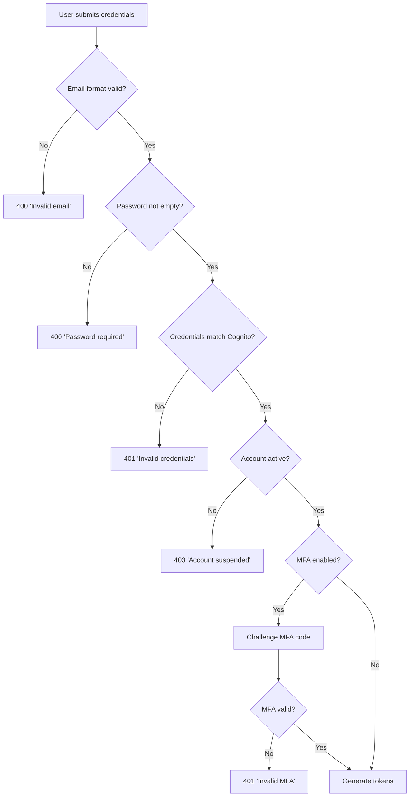

---

## 3. Business Account Registration Flow

### Sequence Diagram

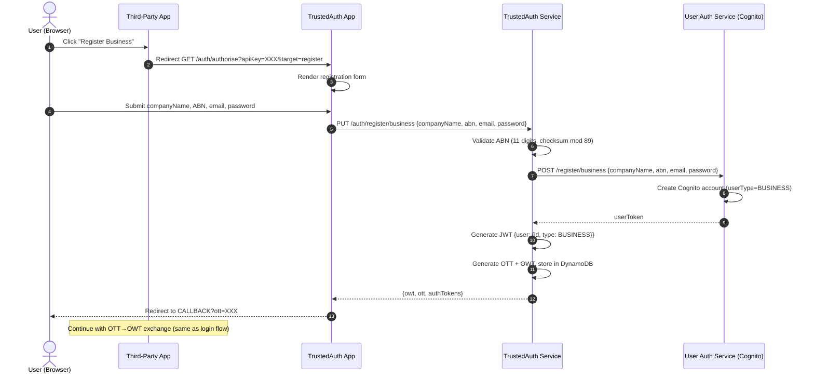

### Key Differences from Personal Registration

1. **ABN Validation** (before any upstream call)
   - Must be exactly 11 digits
   - Checksum: `sum = 10×(d[0]-1) + 1×d[1] + 3×d[2] + ... + 19×d[10]` — valid if `sum % 89 == 0`
   - Returns 400 if invalid

2. **Cognito User Type**: Created with `userType: BUSINESS`

3. **JWT Payload**:
   ```json
   { "user": { "id": "user-token-456", "type": "BUSINESS" } }
   ```

4. **Account Features**: Business name, ABN stored; B2B-specific features enabled

---

## 4. Token Validation Flow

### Profile Fetch with Token Validation

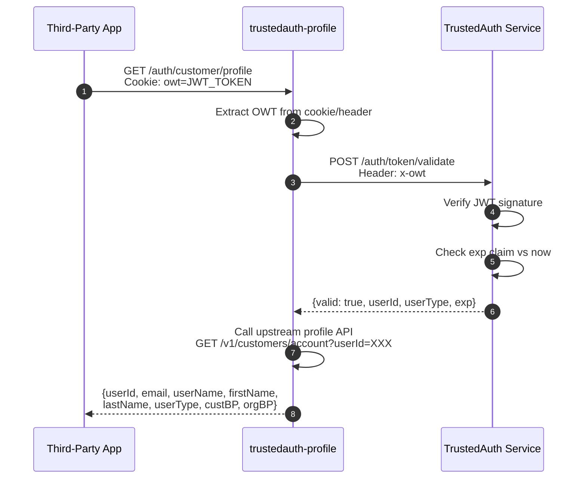

### Validation Details

1. **Extract Token** — from cookie `owt`, header `x-owt` (query params not allowed)
2. **Parse JWT** — validate structure, header, payload, signature
3. **Verify Signature** — compute HMAC-SHA512 on header.payload, compare
4. **Check Expiry** — compare `exp` claim against current timestamp
5. **Return Result**:
   ```json
   {
     "valid": true,
     "userId": "customer-123",
     "userType": "PERSONAL",
     "exp": 1696028800
   }
   ```

### Keepalive Flow

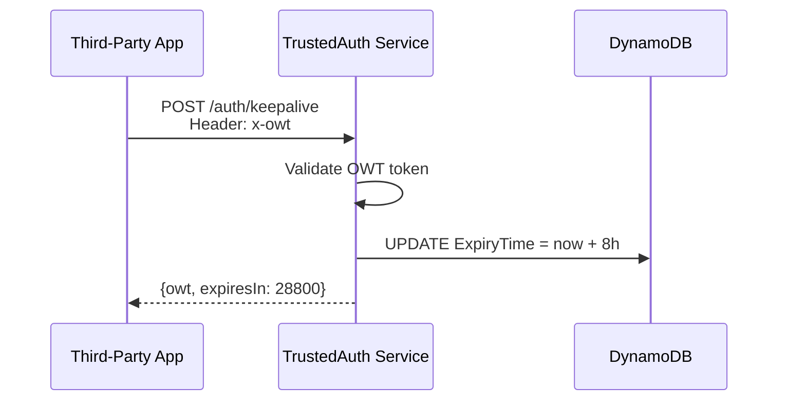

---

## 5. Request Signing Flow

### HMAC-SHA512 Signature Process

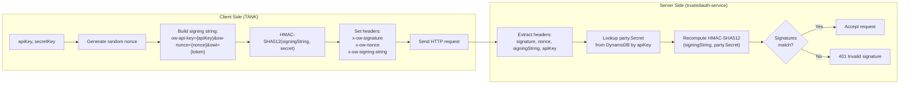

---

## 6. Error Handling Flows

### Authentication Failure Sequence

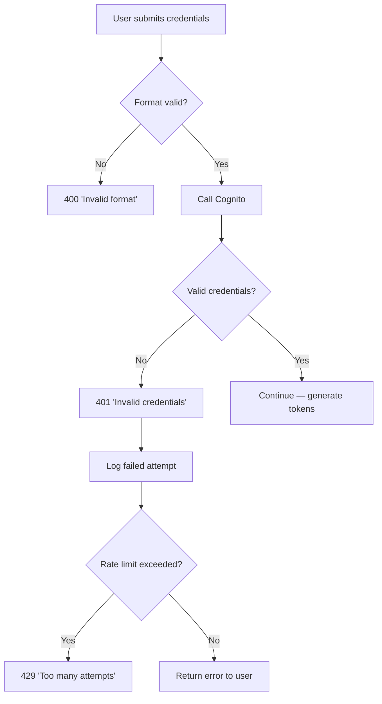

### Token Expiry Handling

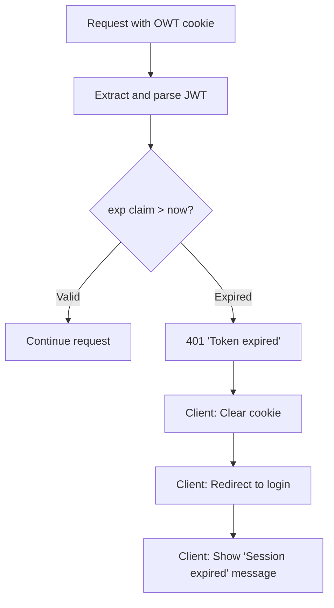

### Signature Validation Failure

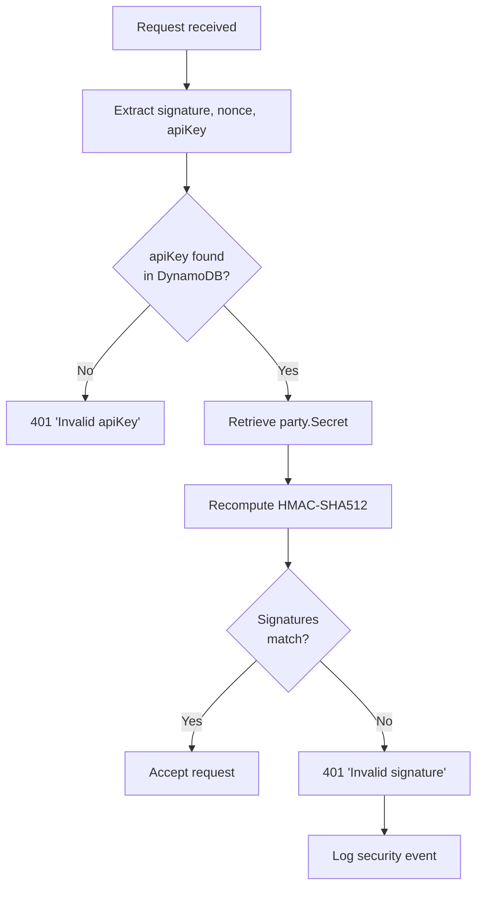

---

## 7. Browser-Based Client Flow (authclient.js)

### Step-by-Step Interaction

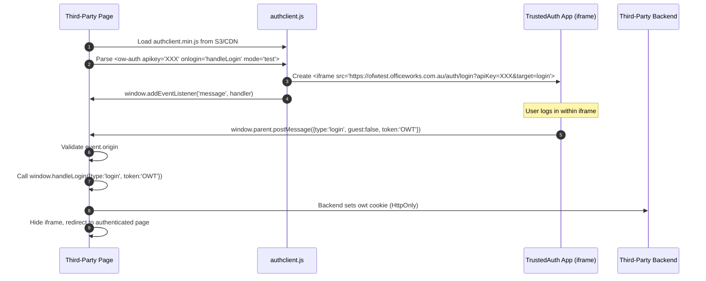

### Message Protocol

| Message Type | Payload | Meaning |
|--------------|---------|---------|
| `login` | `{type:'login', guest:false, token:'OWT'}` | User logged in |
| `register` | `{type:'register', guest:false, token:'OWT'}` | User registered |
| `guest` | `{type:'login', guest:true, token:'OWT'}` | User continued as guest |
| `logout` | `{type:'logout'}` | User logged out |
| `error` | `{type:'error', message:'...'}` | Authentication error |

---

## 8. React/Redux Integration Flow (TARAS)

### Component Initialization and Auth Middleware

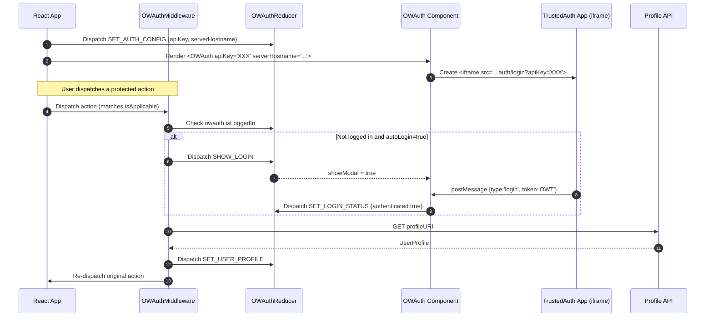

### Redux State Transitions

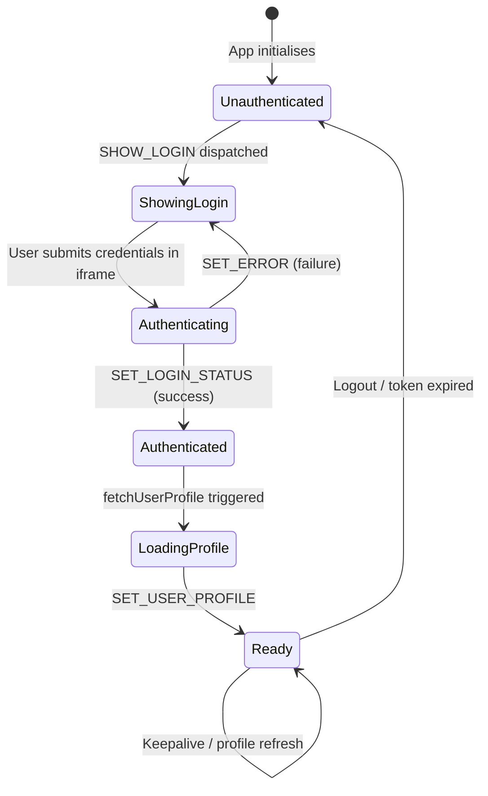

---

## 9. Logout Flow

### Session Termination

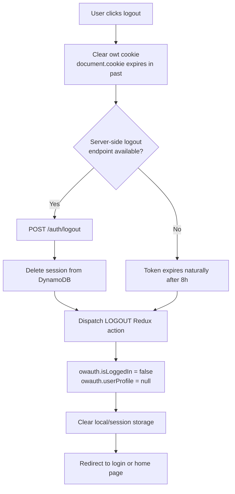

---

## Summary Table

| Flow | Entry Point | Exit Token | Typical Duration | Notes |
|------|------------|-----------|-----------------|-------|
| Guest | `/auth/authorise?target=guest` | OWT via callback | Immediate | Fastest — no credentials needed |
| Login | `/auth/authorise?target=login` | OWT via callback | Credential validation time | Standard flow |
| Register | `/auth/authorise?target=register` | OWT via callback | Account creation time | Requires form fields |
| Token Exchange | TANK `exchangeToken()` | OWT from API | <100ms | Server-side only |
| Profile Fetch | `GET /auth/customer/profile` with OWT | User profile JSON | <100ms | Requires valid OWT |
| Keepalive | `POST /auth/keepalive` | Extended OWT | <50ms | Resets 8-hour window |

---

**Deprecation Notice**: This system is marked for decommissioning January 2026. No new flows should be designed based on this architecture.
