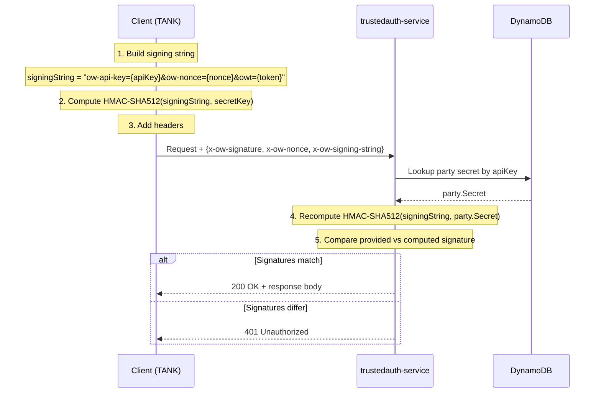

# C3 Component Architecture - Officeworks Third-Party Authentication System

## Overview

This document describes the detailed components within each container, including modules, classes, functions, and their interactions.

---

## 1. TrustedAuth Service Components

### trustedauth-service (Port 3002)

#### Module: tpapi.js
**Purpose**: Trusted Party API operations and token management

```
tpapi.js
├── Database Layer
│   ├── transformTrustedParty(dbItem)
│   │   └─ Converts DynamoDB record to {partyId, name, apiKey,
│   │      secretKey, callbackUrl, nonce, tpClientId}
│   │
│   ├── transformTrustedPartyToken(dbItem)
│   │   └─ Converts DynamoDB token record to {userId, partyId,
│   │      partyToken, userToken, issueTime, ott}
│   │
│   └── buildRecord(dbPromise, getDataFn, transformFn)
│       └─ Promise wrapper for DynamoDB operations
│          - Handles error cases
│          - Applies transformation functions
│
├── Query Operations
│   ├── findById(tpId)
│   │   └─ GET TrustedParty_Api WHERE PartyId = tpId
│   │      Returns: Promise<TrustedParty>
│   │
│   ├── findByApiKey(apiKey)
│   │   └─ QUERY TrustedParty_Api INDEX (ApiKey-index) = apiKey
│   │      Returns: Promise<TrustedParty>
│   │      Note: Query returns array, extracts first item
│   │
│   ├── findByPartyToken(partyToken)
│   │   └─ QUERY TrustedParty_Tokens INDEX (PartyToken-index)
│   │      Returns: Promise<TrustedPartyToken>
│   │
│   └── findUserTokenByUserId(userId)
│       └─ QUERY TrustedParty_UserToken WHERE UserId = userId
│          Returns: Promise<UserToken>
│
├── Create/Update Operations
│   ├── registerParty(tpId?, name, apiKey, secretKey,
│   │                 callbackUrl, nonce)
│   │   └─ PUT TrustedParty_Api
│   │      - Auto-generates ID if not supplied
│   │      - Generates random apiKey if not supplied
│   │      - Generates secretKey for HMAC signing
│   │      Returns: Promise<TrustedParty>
│   │
│   ├── updateParty(tpId, {name, callbackUrl, nonce})
│   │   └─ UPDATE TrustedParty_Api WHERE PartyId = tpId
│   │      Returns: Promise<TrustedParty>
│   │
│   └── deleteParty(tpId)
│       └─ DELETE TrustedParty_Api WHERE PartyId = tpId
│          Returns: Promise<{ deleted: true }>
│
├── Token Operations
│   ├── createOrUpdateUserToken(userToken, userId)
│   │   └─ PUT TrustedParty_UserToken
│   │      Maps user token to user ID
│   │      Returns: Promise<UserToken>
│   │
│   ├── genToken(trustedParty, userToken, payload)
│   │   └─ Generate OTT and OWT tokens
│   │      Process:
│   │      1. Create JWT with payload
│   │      2. Generate random OTT string
│   │      3. Store in TrustedParty_Tokens table
│   │      4. Return {owt, ott, userToken}
│   │      Returns: Promise<{owt, ott, userToken}>
│   │
│   ├── validateSignature(signature, payload, secret)
│   │   └─ HMAC-SHA512 signature verification
│   │      Algorithm:
│   │      1. Compute HMAC-SHA512(payload, secret)
│   │      2. Compare with provided signature
│   │      3. Return boolean or throw error
│   │
│   └── validateToken(token)
│       └─ JWT validation and parsing
│          Returns: Promise<{userId, userType, issued, expires}>
│
└── DynamoDB Integration
    └─ AWS SDK v3 (@aws-sdk/lib-dynamodb)
       - DynamoDBDocument client
       - Region: ap-southeast-2
       - Tables configured in config.js
```

#### Module: userapi.js
**Purpose**: Upstream user authentication service integration

```
userapi.js
├── HTTP Client Operations
│   ├── guestToken()
│   │   └─ GET {endpoint.guest}
│   │      - Requests guest token from Officeworks API
│   │      - Returns: Promise<userToken>
│   │
│   ├── authTokens(userToken)
│   │   └─ GET {endpoint.usercookies.url}
│   │      - Fetch browser cookies for authenticated user
│   │      - Returns: Promise<{wc_auth, wc_session, ...}>
│   │
│   ├── login(credentials)
│   │   └─ POST {endpoint.login}
│   │      Body: { email, password }
│   │      - Validates credentials against upstream API
│   │      - Returns: Promise<userToken>
│   │
│   ├── register(type, formData)
│   │   └─ POST {endpoint.register.personal|business}
│   │      Type: 'personal' or 'business'
│   │      Body: {email, password, firstName, lastName, ...}
│   │      - Creates new account
│   │      - Returns: Promise<userToken>
│   │
│   └── fetchAuthTokens(userToken)
│       └─ GET {endpoint.fetchAuthTokens.url}
│          - Fetch auth tokens for user session
│          - Returns: Promise<{authToken, ...}>
│
├── Configuration
│   ├── Endpoints from config.js
│   │   - login
│   │   - guest
│   │   - register.personal
│   │   - register.business
│   │   - usercookies
│   │   - fetchAuthTokens
│   │
│   ├── Request Timeout
│   │   └─ config.requestTimeout (default: 20000ms)
│   │
│   └── Error Handling
│       ├── Network errors
│       ├── HTTP 4xx/5xx responses
│       └─ Returns detailed error objects
│
└── Dependencies
    └─ request library for HTTP calls
       util.fetch() wrapper
```

#### Module: util.js
**Purpose**: Utility functions for cryptography, validation, and helpers

```
util.js
├── Cryptographic Functions
│   ├── hash(str)
│   │   └─ SHA512 hash of string
│   │      Uses: crypto.createHash('sha512')
│   │      Returns: hexadecimal hash
│   │
│   └── getSignaturePayLoadFromRequest(req)
│       └─ Extract signature-related fields from request
│          Reads headers:
│          - x-owt (Officeworks Token)
│          - x-ott (One-Time Token)
│          - x-ow-signature (HMAC signature)
│          - x-ow-nonce (Random nonce)
│          - x-ow-signing-string (Data signed)
│          Reads query params:
│          - apiKey
│          Returns: {ows, nonce, apiKey, signatureString, owt|ott}
│
├── ID Generation Functions
│   ├── uuid4()
│   │   └─ Generate UUID v4
│   │      Returns: string (UUID format)
│   │
│   └── genRandomStr(len)
│       └─ Generate random alphanumeric string
│          Parameter: length in characters
│          Returns: random string
│
├── Validation Functions
│   ├── isValidAbn(abn)
│   │   └─ Validate Australian Business Number
│   │      Algorithm:
│   │      1. Check 11 digits
│   │      2. Apply ABN checksum algorithm
│   │      3. Verify against weights [10,1,3,5,7,9,11,13,15,17,19]
│   │      Returns: boolean
│   │
│   ├── isNumeric(n)
│   │   └─ Check if value is numeric
│   │      Returns: boolean
│   │
│   └── digits(num)
│       └─ Convert number to array of digits
│          Returns: [1, 2, 3, ...] for 123
│
└── HTTP Utilities
    ├── fetch(options, respHandler, errHandler)
    │   └─ Promise-wrapped HTTP request
    │      - Sets timeout from config
    │      - Handles 200/201 success codes
    │      - Applies response/error handlers
    │      - Returns: Promise<response>
    │
    └─ Dependencies
       ├─ crypto module
       ├─ uuid/v4
       ├─ randomstring
       └─ request
```

#### Module: routes/auth.js
**Purpose**: Customer authentication endpoints

```
routes/auth.js
├── Middleware
│   └─ API Key Validation
│      ├─ Check for apiKey in query params or body
│      ├─ Lookup trusted party by apiKey
│      ├─ Attach party object to req.party
│      └─ Return 400 if apiKey missing, 401 if invalid
│
├── Route Handlers
│   ├── guestToken(req, res)
│   │   Method: PUT /auth/token/guest
│   │   Process:
│   │   1. Get guest token from user-auth-service
│   │   2. Get auth tokens (cookies)
│   │   3. Create user token mapping
│   │   4. Generate JWT token with GUEST type
│   │   5. Store in DynamoDB
│   │   6. Return {owt, ott, authTokens, user}
│   │   Status: 201 Created
│   │
│   ├── register(req, res)
│   │   Method: PUT /auth/register
│   │   Body: {email, password, firstName, lastName, ...}
│   │   Process:
│   │   1. Register personal account via user-auth-service
│   │   2. Get auth tokens
│   │   3. Generate JWT with PERSONAL type
│   │   4. Store token and user mapping
│   │   5. Return token response with OTT
│   │   Status: 201 Created
│   │
│   ├── registerBusiness(req, res)
│   │   Method: PUT /auth/register/business
│   │   Body: {companyName, abn, email, password, ...}
│   │   Process:
│   │   1. Validate ABN format
│   │   2. Register business account
│   │   3. Same token flow as register
│   │   Status: 201 Created
│   │
│   ├── login(req, res)
│   │   Method: POST /auth/login
│   │   Body: {email, password}
│   │   Process:
│   │   1. Call user-auth-service.login(credentials)
│   │   2. If successful, get auth tokens
│   │   3. Generate JWT with user type
│   │   4. Create OTT and OWT
│   │   5. Return token response
│   │   Status: 200 OK
│   │
│   ├── validateToken(req, res)
│   │   Method: POST /auth/token/validate
│   │   Headers: x-owt or x-ott
│   │   Process:
│   │   1. Extract token from headers
│   │   2. Verify JWT signature
│   │   3. Check token expiry
│   │   4. Return validation result
│   │   Returns: {valid: boolean, user: {...}, expires: ...}
│   │
│   ├── fetchToken(req, res)
│   │   Method: GET /auth/token
│   │   Query: ott (OTT token)
│   │   Headers: x-ott, x-ow-signature, x-ow-nonce
│   │   Process:
│   │   1. Validate HMAC-SHA512 signature
│   │   2. Lookup OTT in DynamoDB
│   │   3. Return OWT if OTT valid
│   │   4. Return 401 if invalid
│   │   Returns: {owt: string}
│   │
│   ├── keepAlive(req, res)
│   │   Method: POST /auth/keepalive
│   │   Headers: x-owt
│   │   Process:
│   │   1. Validate OWT token
│   │   2. Extend session expiry in DynamoDB
│   │   3. Return updated token info
│   │   Returns: {owt, expiresIn}
│   │
│   └─ tokenForCookies(req, res)
│       Method: PUT /auth/token/cookies
│       Body: {wc_auth, wc_session, ...} (legacy)
│       Process:
│       1. Convert WC cookies to OWT
│       2. Legacy compatibility endpoint
│       Returns: {owt, user}
│
└── Response Format
    └─ buildResponseObject(owt, ott, authTokens, payload)
       Returns:
       {
         owt: string,
         ott: string,
         authTokens: {...},
         user: {
           id: string,
           type: "GUEST|PERSONAL|BUSINESS"
         }
       }
```

#### Module: routes/tpAdmin.js
**Purpose**: Trusted Party management endpoints (admin only)

```
routes/tpAdmin.js
├── Middleware
│   └─ Admin Key Validation
│      ├─ Require X-OW-ADMIN-KEY header
│      ├─ Compare against config.adminHeader
│      └─ Return 401 if missing or invalid
│
├── Route Handlers
│   ├── POST /:tpId
│   │   Create trusted party with specified ID
│   │   Body: {name, callbackUrl, nonce}
│   │   Returns: TrustedParty object
│   │
│   ├── POST /
│   │   Create trusted party with auto-generated ID
│   │   Body: {name, callbackUrl, nonce}
│   │   Returns: TrustedParty object with auto-generated partyId
│   │
│   ├── PUT /:tpId
│   │   Update trusted party
│   │   Query params: callbackUrl, name, nonce
│   │   Returns: Updated TrustedParty object
│   │
│   ├── DELETE /:tpId
│   │   Delete trusted party
│   │   Returns: {deleted: true}
│   │
│   ├── GET /:tpId
│   │   Get trusted party by ID
│   │   Returns: TrustedParty object
│   │
│   └─ GET /apiKey/:apiKey
│       Get trusted party by API key
│       Returns: TrustedParty object
│
└── Response Format
    {
      partyId: string,
      name: string,
      apiKey: string (public),
      secretKey: string (private - HMAC secret),
      callbackUrl: string,
      nonce: string,
      tpClientId: string
    }
```

#### Module: routes/userAdmin.js
**Purpose**: User authentication admin endpoints

```
routes/userAdmin.js
├── Middleware
│   └─ Admin Key Validation
│      ├─ Require headers: X-OW-AGENTTOKEN, X-OW-ADMIN-KEY
│      ├─ Optional: X-OW-SIGNATURE, X-OW-NONCE
│      └─ Return 401 if missing
│
├── Route Handlers
│   ├── GET /token
│   │   Require: OWT cookie or header
│   │   Process:
│   │   1. Validate OWT token
│   │   2. Lookup user token mapping
│   │   3. Return API token for given OWT
│   │   Returns: {userToken: string}
│   │
│   └─ GET /cookies
│       Require: OWT cookie or header
│       Process:
│       1. Validate OWT token
│       2. Fetch WC (web client) cookies
│       3. Return legacy cookie format
│       Returns: {wc_auth, wc_session, ...}
│
└─ Used by: Internal admin operations, legacy integrations
```

---

## 2. TrustedAuth App Components

### trustedauth-app (Port 3001)

```
trustedauth-app/
├── Views (Handlebars templates)
│   ├── login.hbs
│   │   └─ Login form with email/password
│   │
│   ├── register.hbs
│   │   └─ Registration form with validation
│   │      - Personal: email, password, firstName, lastName
│   │      - Business: companyName, abn, email, password
│   │
│   ├── guest.hbs
│   │   └─ Continue as guest button
│   │
│   └─ authorize.hbs
│       └─ OAuth authorization confirmation
│
├── Routes
│   ├── GET /auth/login
│   │   ├─ Render login form
│   │   └─ Accept params: apiKey, cb, target
│   │
│   ├── GET /auth/register
│   │   ├─ Render registration form
│   │   └─ Accept params: apiKey, cb
│   │
│   ├── POST /auth/login
│   │   ├─ Process form submission
│   │   ├─ Call trustedauth-service
│   │   └─ Redirect to callback with OTT
│   │
│   ├── POST /auth/register
│   │   ├─ Process registration
│   │   ├─ Call trustedauth-service
│   │   └─ Auto-login and redirect with OTT
│   │
│   ├── GET /auth/guest
│   │   ├─ Generate guest token
│   │   ├─ Call trustedauth-service
│   │   └─ Redirect to callback with OTT
│   │
│   └─ GET /auth/authorise
│       ├─ Main OAuth endpoint
│       ├─ Route to login/register/guest based on target
│       └─ Accept params: apiKey, cb, target, guest
│
├── Client-side JavaScript
│   ├── lib/client/owauth.js
│   │   └─ Communication with parent window
│   │      - window.postMessage for iframe
│   │      - Pass login/register/guest events
│   │
│   └─ public/js/
│       ├─ jQuery manipulation
│       └─ Form validation
│
└── Configuration
    └─ Support for local/test/master environments
```

---

## 3. TrustedAuth Profile Components

### trustedauth-profile (Port 3004)

```
trustedauth-profile/
├── Route Handler: routes/customer.js
│   └─ GET /auth/customer/profile
│      ├─ Extract OWT from headers (x-owt)
│      ├─ Validate signature via tpapi
│      ├─ Call userProfileClient to fetch upstream profile
│      ├─ Return profile data
│      └─ Returns:
│         {
│           userId: string,
│           userName: string,
│           userType: string,
│           email: string,
│           firstName: string,
│           lastName: string,
│           phone: string,
│           mobile: string,
│           custBP: string,
│           orgBP: string
│         }
│
├── Module: userProfileClient.js
│   ├── getProfile(userToken)
│   │   └─ HTTP GET to upstream API
│   │      Endpoint: config.endpoints.userinfo
│   │      Returns: Promise<UserProfile>
│   │
│   └─ Configuration
│       └─ Upstream endpoint from config.js
│
└── Status Endpoint: routes/status.js
    └─ GET /status (health check)
```

---

## 4. User Auth Service Components

### user-auth-service (AWS ECS)

```
user-auth-service/
├── OpenAPI/Swagger Specification
│   ├── app/spec/swagger.yaml
│   │   └─ Main API specification file
│   │
│   ├── app/spec/paths.yaml
│   │   └─ RESTful endpoint definitions
│   │      - POST /register/personal
│   │      - POST /register/business
│   │      - POST /auth
│   │      - GET /auth/guest
│   │      - GET /account (profile)
│   │      - POST /tokens (auth cookies)
│   │
│   ├── app/spec/definitions.yaml
│   │   └─ Data model schemas
│   │      - User
│   │      - Credentials
│   │      - AuthToken
│   │      - UserProfile
│   │      - BusinessUser
│   │
│   └─ app/spec/parameters.yaml
│       └─ Common parameter definitions
│
├── Application Code (app/src/)
│   ├── routes/ (Route handlers)
│   │   ├─ registerPersonal(email, password, firstName, lastName)
│   │   ├─ registerBusiness(companyName, abn, email, password)
│   │   ├─ login(email, password)
│   │   ├─ getGuest()
│   │   ├─ getProfile(userToken)
│   │   └─ getAuthTokens(userToken)
│   │
│   └─ services/ (Business logic)
│       ├─ CognitoUserPoolService
│       │   ├─ Create user in Cognito
│       │   ├─ Validate credentials
│       │   ├─ Manage user attributes
│       │   └─ Handle MFA
│       │
│       ├─ UserProfileService
│       │   ├─ Fetch user attributes
│       │   ├─ Manage profile data
│       │   └─ Link to business entities
│       │
│       └─ SessionService
│           ├─ Generate session tokens
│           ├─ Manage auth cookies
│           └─ Track user sessions
│
├── Infrastructure as Code
│   ├── scripts/infra/templates/
│   │   ├─ cognito-user-pool.yaml
│   │   │   └─ CloudFormation template for user pool
│   │   │      - Password policies
│   │   │      - MFA requirements
│   │   │      - Email verification
│   │   │      - User attributes
│   │   │
│   │   └─ cognito-access.yaml
│   │       └─ Cognito app client configuration
│   │          - JWT claim mappings
│   │          - Token expiry
│   │          - Callback URLs
│   │
│   └─ scripts/infra/ow-config/
│       ├─ [environment]/config.yaml
│       ├─ [environment]/ecs.yaml
│       ├─ [environment]/task-role.yaml
│       ├─ [environment]/cognito-user-pool.yaml
│       └─ [environment]/cognito-access.yaml
│
└── Testing
    └─ tests/component/ (Component tests)
       └─ Verify authentication flows
```

---

## 5. Client Library Components

### trustedauth-node-client (TANK)

```
trustedauth-node-client/
├── Main Export: src/auth/client.js
│   └─ class Client
│       ├─ Constructor(apiKey, serverUrl, internalServerUrl, secret)
│       │
│       ├─ Public Methods
│       │   ├─ getProfile(owt): Promise<UserProfile>
│       │   │   └─ Calls signedReq('get', PROFILE_URI, ...)
│       │   │
│       │   ├─ exchangeToken(ott): Promise<{owt}>
│       │   │   └─ Exchange OTT for OWT with signature
│       │   │
│       │   ├─ validateToken(owt): Promise<ValidationResult>
│       │   │   └─ Internal endpoint only
│       │   │
│       │   └─ expressMiddleware(whitelist): Middleware
│       │       └─ Validate owt cookie on matching paths
│       │
│       └─ Private Methods
│           ├─ signedReq(method, uri, params, headers)
│           │   └─ HMAC-SHA512 signing implementation
│           │      1. Generate nonce
│           │      2. Create signing string
│           │      3. Compute HMAC(signing string, secret)
│           │      4. Add headers to request
│           │      5. Send HTTP request
│           │      6. Return Promise<response>
│           │
│           └─ req(method, uri, headers, internal)
│               └─ Unsigned HTTP request wrapper
│
├── Express Helper: src/auth/expressHelper.js
│   └─ Express middleware factory
│      - Attach to app.use()
│      - Validate owt cookie
│      - Pass auth context to next middleware
│
└── Dependencies
    ├─ node-rest-client (HTTP)
    ├─ crypto (HMAC-SHA512)
    └─ promise
```

### trustedauth-react-redux (TARAS)

```
trustedauth-react-redux/
├── Components
│   ├── OWAuth Component
│   │   ├─ Props: apiKey, serverHostname, width, height,
│   │   │         iframeOptions, mode
│   │   ├─ Internal State
│   │   │   └─ Redux store integration (owauth reducer)
│   │   ├─ Render
│   │   │   └─ Modal/iframe with authentication UI
│   │   └─ Event Handlers
│   │       ├─ Listen for authentication results
│   │       ├─ Dispatch Redux actions
│   │       └─ Handle errors
│   │
│   └─ Protected Routes
│       └─ Wrapper component for auth-required routes
│
├── Redux Integration
│   ├── OWAuthReducer
│   │   ├─ Initial State
│   │   │   {
│   │   │     isLoggedIn: false,
│   │   │     userProfile: null,
│   │   │     showModal: false,
│   │   │     error: null,
│   │   │     config: {
│   │   │       apiKey: null,
│   │   │       serverHostname: null
│   │   │     }
│   │   │   }
│   │   │
│   │   └─ Handled Actions
│   │       ├─ SET_AUTH_CONFIG
│   │       ├─ SET_USER_PROFILE
│   │       ├─ SET_LOGIN_STATUS
│   │       ├─ SHOW_LOGIN
│   │       ├─ SHOW_REGISTER
│   │       ├─ HIDE_MODAL
│   │       └─ SET_ERROR
│   │
│   ├── OWAuthMiddleware
│   │   ├─ Parameters
│   │   │   ├─ isApplicable: (action) => boolean
│   │   │   ├─ profileURI: string
│   │   │   └─ autoLogin: boolean
│   │   │
│   │   ├─ Processing
│   │   │   1. Intercept actions
│   │   │   2. Check isApplicable
│   │   │   3. If not logged in:
│   │   │      - Dispatch SHOW_LOGIN
│   │   │      - Wait for authentication
│   │   │   4. Fetch profile from profileURI
│   │   │   5. Dispatch SET_USER_PROFILE
│   │   │   6. Re-dispatch original action
│   │   │
│   │   └─ Note: Cannot be used with action creators
│   │          that perform async work directly
│   │          (use redux-thunk instead)
│   │
│   └─ Action Creators
│       ├─ fetchUserProfile(profileURI)
│       ├─ setUserProfile(profile)
│       ├─ hideModal()
│       ├─ retrieveToken()
│       ├─ setError(message)
│       ├─ setLoginStatus(data)
│       ├─ showLogin()
│       └─ showRegister()
│
├── Type Definitions
│   └─ OWAuthPropType
│       └─ PropTypes for Redux owauth state
│
└── Build Process
    ├─ webpack configuration
    └─ Produces: dist/index.js
```

### trustedauth-client (Browser Library)

```
trustedauth-client/
├── Global API: window.owauth
│   ├─ init()
│   │   └─ Initialize authentication client
│   │
│   ├─ status()
│   │   └─ Check current login status
│   │
│   └─ authorise()
│       └─ Trigger authorization flow
│
├── Custom HTML Element: <ow-auth>
│   ├─ Attributes
│   │   ├─ apikey (required)
│   │   ├─ onlogin (callback function name)
│   │   ├─ mode (test|local|production)
│   │   ├─ target (login|register|guest)
│   │   ├─ guest (true|false - show guest option)
│   │   ├─ guestToken (true|false)
│   │   ├─ debug (true|false)
│   │   └─ btnLabel (button text)
│   │
│   ├─ Behavior
│   │   1. On DOMContentLoaded:
│   │      - Find <ow-auth> elements
│   │      - Extract attributes
│   │      - Create iframe with login URL
│   │      - Setup event listeners
│   │   2. On user interaction:
│   │      - User logs in within iframe
│   │      - iframe posts message to parent
│   │   3. Parent receives postMessage:
│   │      - Extract login result
│   │      - Call onlogin callback
│   │      - Set OWT cookie
│   │
│   └─ Message Format
│       {
│         type: 'login'|'logout'|'register',
│         guest: boolean,
│         token: string (OWT)
│       }
│
├── URL Construction
│   └─ Iframe src: {domain}/auth/login?apiKey={key}&btnLabel={label}
│      &target={target}&debug={debug}&showGuest={guest}
│
├── Domain Selection
│   ├─ Production: https://www.officeworks.com.au
│   ├─ Test: https://ofwtest.officeworks.com.au
│   └─ Local: http://localhost:3001
│
├── Event Communication
│   ├─ Parent listeners
│   │   └─ window.addEventListener('message', handler)
│   │
│   ├─ Message validation
│   │   └─ Check event.origin for security
│   │
│   └─ Callback invocation
│       └─ Call window[onlogin] callback function
│
└── Polyfills
    └─ Object.assign (for older browsers)
```

---

## 6. Database Schema (DynamoDB)

### Table: TrustedParty_Api

| Attribute | Type | Key | Notes |
|-----------|------|-----|-------|
| PartyId | String | HASH (PK) | Unique party identifier |
| Name | String | | Display name |
| ApiKey | String | GSI: ApiKey-index | Public API key |
| Secret | String | | Private HMAC secret |
| CallbackUrl | String | | OAuth callback endpoint |
| Nonce | String | | Security nonce |
| TpClientId | String | | Client identifier |
| CreatedAt | Number | | Epoch timestamp |

**Example item:**
```json
{
  "PartyId": "90003",
  "Name": "accis",
  "ApiKey": "Izj5SZEe8b7L4vxG01N0",
  "Secret": "OIHMFfAv24sInyNd6EOdzrVTRMxOtct8QXSOUV18",
  "CallbackUrl": "http://www.owt.com",
  "Nonce": "393939393939",
  "TpClientId": "90003"
}
```

### Table: TrustedParty_Tokens

| Attribute | Type | Key | Notes |
|-----------|------|-----|-------|
| UserToken | String | HASH (PK) | User token from upstream |
| PartyId | String | RANGE (SK) | Trusted party ID |
| PartyToken | String | | JWT token (OWT) issued |
| OneTimeToken | String | | OTT for token exchange |
| UserId | String | | Upstream user ID |
| IssueTime | Number | | Epoch timestamp |
| ExpiryTime | Number | | TTL — 8 hours from issue |
| UserType | String | | `GUEST` \| `PERSONAL` \| `BUSINESS` |

**Example item:**
```json
{
  "UserToken": "user-token-123",
  "PartyId": "90003",
  "PartyToken": "JWT...",
  "OneTimeToken": "ott-abc-def",
  "UserId": "customer-123",
  "IssueTime": 1696000000,
  "ExpiryTime": 1696028800,
  "UserType": "PERSONAL"
}
```

### Table: TrustedParty_UserToken

| Attribute | Type | Key | Notes |
|-----------|------|-----|-------|
| UserId | String | HASH (PK) | User identifier |
| UserToken | String | | Maps to upstream user token |
| CreatedAt | Number | | Epoch timestamp |

---

## 7. Request/Response Signing

### HMAC-SHA512 Signature Algorithm



**Implementation (Node.js):**
```javascript
const crypto = require('crypto');

function sign(dataToSign, secret) {
  return crypto
    .createHmac('sha512', secret)
    .update(dataToSign)
    .digest('hex');
}

// Signing string format (ordered params):
const signingString = `ow-api-key=${apiKey}&ow-nonce=${nonce}&owt=${token}`;
const signature = sign(signingString, secretKey);
```

**Protected Request Headers:**

| Header | Value | Required |
|--------|-------|----------|
| `X-OW-SIGNATURE` | Hex-encoded HMAC-SHA512 | Yes |
| `X-OW-NONCE` | Random string (per-request) | Yes |
| `X-OW-AGENTTOKEN` | Agent credentials (admin only) | Admin routes |
| `X-OW-ADMIN-KEY` | Admin API key | Admin routes |

---

## Summary Table

| Component | Technology | Responsibility | Port |
|-----------|-----------|-----------------|------|
| trustedauth-app | Express + Handlebars | OAuth UI & authorization | 3001/3003 |
| trustedauth-service | Express + Node.js | Token generation & validation | 3002 |
| user-auth-service | Node.js + TypeScript + Cognito | User credential validation | 3000 |
| trustedauth-profile | Express + Node.js | User profile endpoint | 3004 |
| trustedauth-node-client | NPM package | Server-side integration | — |
| trustedauth-react-redux | NPM package | React/Redux integration | — |
| trustedauth-client | Browser JS (CDN) | Client-side authentication | — |

---

**Deprecation Status**: System will be decommissioned January 2026.
